# Workshop Summary Automation Platform Fullstack Architecture Document

## Introduction

This document outlines the complete fullstack architecture for **Workshop Summary Automation Platform**, including backend systems, frontend implementation, and their integration. It serves as the single source of truth for AI-driven development, ensuring consistency across the entire technology stack.

This unified approach combines what would traditionally be separate backend and frontend architecture documents, streamlining the development process for modern fullstack applications where these concerns are increasingly intertwined.

### Starter Template or Existing Project

Based on the PRD analysis and technical requirements, this is a **greenfield project** with specific integration constraints:

**Existing Infrastructure Dependencies:**
- **Zoom → Make.com → HubSpot** workflow already established
- **HubSpot CRM** serves as primary data repository
- **Make.com scenarios** handle existing automation workflows
- **OpenAI/ChatGPT** for AI capabilities and coach interface

**Architectural Constraints:**
- Must integrate seamlessly with existing Make.com workflows
- Cannot disrupt current Zoom transcript processing
- HubSpot API integration required for data persistence
- ChatGPT Actions integration for coach review interface

**Recommended Approach:**
Given the **1-week aggressive timeline** and integration requirements, I recommend a **serverless-first architecture** that leverages existing infrastructure rather than a traditional full-stack starter template. The system will be built as lightweight API services that slot into the existing Make.com workflow while providing ChatGPT Actions endpoints.

**Key Rationale:**
- Minimizes deployment complexity for rapid MVP delivery
- Leverages proven Zoom → Make → HubSpot data flow
- Reduces risk by building around existing coach workflows
- Enables incremental rollout without disrupting current operations

### Change Log
| Date | Version | Description | Author |
|------|---------|-------------|---------|
| 2025-08-16 | 1.0 | Initial architecture document creation | Winston (Architect Agent) |

## High Level Architecture

### Technical Summary

The Workshop Summary Automation Platform uses **Make.com as the primary processing engine** with structured OpenAI prompts for transcript analysis and content generation. The system requires only **lightweight webhook endpoints** for ChatGPT Actions integration, eliminating serverless complexity. Make.com scenarios handle transcript ingestion, AI processing through OpenAI modules, data storage to HubSpot, and email notifications to coaches. ChatGPT Actions provide simple REST endpoints that trigger specific Make.com scenarios for data retrieval and updates, creating a coach review interface without custom application development.

### Platform and Infrastructure Choice

**Platform:** Make.com + ChatGPT Actions (No AWS needed for MVP)  
**Key Services:** Make.com scenarios, OpenAI modules, HubSpot connector, Email modules  
**Deployment Host:** Make.com cloud infrastructure  

### Repository Structure

For this serverless-microservices approach with tight integration requirements, I recommend a **monorepo structure** to enable rapid development and coordinated deployments:

**Structure:** Monorepo with service-based organization  
**Monorepo Tool:** npm workspaces (lightweight, sufficient for MVP scope)  
**Package Organization:** Services separated by function (transcript-processor, chatgpt-actions, shared-types)

**Rationale:** The serverless functions and API endpoints need to share TypeScript interfaces and utility functions. A monorepo ensures type safety across services while maintaining deployment independence. Given the 1-week timeline, npm workspaces provides sufficient organization without the complexity of Nx or Turborepo.

### High Level Architecture Diagram

```mermaid
graph TB
    Coach[👨‍💼 Coach] --> Email[📧 Email Notification]
    Zoom[🎥 Zoom Workshop] --> MakeComTrigger[⚡ Make.com Trigger]
    
    subgraph "Existing Infrastructure"
        MakeComTrigger --> MakeComScenario[🔄 Make.com Scenario]
        MakeComScenario --> HubSpot[(🗄️ HubSpot CRM)]
    end
    
    subgraph "New Workshop Automation Platform"
        MakeComScenario --> TranscriptProcessor[🧠 Transcript Processor<br/>AWS Lambda]
        TranscriptProcessor --> OpenAI[🤖 OpenAI GPT-4]
        TranscriptProcessor --> MakeComScenario
        
        Email --> ChatGPT[💬 ChatGPT Interface]
        ChatGPT --> ChatGPTActions[🔌 ChatGPT Actions<br/>API Gateway + Lambda]
        ChatGPTActions --> HubSpot
    end
    
    subgraph "External Services"
        OpenAI
        SES[📨 AWS SES<br/>Email Service]
    end
    
    MakeComScenario --> SES
    Coach --> HubSpot
    
    style TranscriptProcessor fill:#ff9999
    style ChatGPTActions fill:#99ccff
    style MakeComScenario fill:#99ff99
```



### Architectural Patterns

**Event-Driven Processing:** Make.com webhooks trigger transcript analysis with asynchronous processing - _Rationale:_ Enables reliable processing of variable workshop timing without blocking operations

**External Service Integration:** ChatGPT Actions serve as bridge between AI interface and backend data - _Rationale:_ Leverages existing coach familiarity with ChatGPT while maintaining data control

**Hybrid Data Strategy:** HubSpot as primary storage with temporary processing state in Make.com - _Rationale:_ Minimizes custom database infrastructure while leveraging existing coach workflows

**API Gateway Pattern:** Single entry point for ChatGPT Actions with authentication and rate limiting - _Rationale:_ Centralized security and monitoring for external AI service integration

**Orchestration Layer Pattern:** Make.com scenarios coordinate multi-step workflows across services - _Rationale:_ Visual workflow management for non-technical maintenance and rapid iteration

## Tech Stack

This is the DEFINITIVE technology selection for the entire project. This table serves as the single source of truth - all development must use these exact versions.

### Technology Stack Table

| Category | Technology | Version | Purpose | Rationale |
|----------|------------|---------|---------|-----------|
| **Primary Orchestration** | Make.com | Current | Workflow automation and AI processing orchestration | Leverages existing coach infrastructure, visual debugging, immediate deployment |
| **AI Processing** | OpenAI GPT-4o (transitioning to GPT-5) | gpt-4o-2024-08-06 → GPT-5 when available | Transcript analysis and content generation | GPT-4o for immediate MVP, GPT-5 upgrade path for enhanced accuracy and reasoning |
| **Data Storage** | HubSpot CRM | Current Plan | Primary client data and summary storage | Existing coach workflow integration, no additional database needed |
| **Coach Interface** | ChatGPT (Custom GPT) | GPT-4 | Coach review and content refinement interface | Familiar interface, natural language interaction, no custom UI development |
| **Email Service** | Make.com Email Module | Current | Coach notification system | Integrated with existing workflow, immediate availability |
| **API Integration** | ChatGPT Actions | Current | Bridge between ChatGPT and Make.com | Enables conversational data access and updates |
| **Webhook Handling** | Make.com Webhooks | Current | ChatGPT Actions endpoint handling | Native Make.com capability, visual error handling |
| **Testing Framework** | Make.com Test Mode | Current | Scenario testing and debugging | Built-in testing environment, real-time validation |
| **Error Handling** | Make.com Error Handlers | Current | Automatic retries and failure management | Visual error routing, email alerts, automatic recovery |
| **Authentication** | Make.com API Keys | Current | Secure service-to-service communication | Integrated authentication, no custom auth implementation |
| **Monitoring** | Make.com Execution Logs | Current | Workflow monitoring and performance tracking | Real-time execution visibility, automatic logging |
| **Version Control** | Make.com Blueprint Export | Current | Scenario backup and version management | Visual diff comparison, rollback capability |
| **Documentation** | Make.com Scenario Notes | Current | Workflow documentation and maintenance | Inline documentation, stakeholder visibility |
| **Cost Management** | Make.com Usage Metrics | Current | API call tracking and optimization | Built-in usage monitoring, cost alerts |

## Data Models

Based on the PRD requirements and Make.com/HubSpot integration approach, I'll define the core data entities that will flow through the system. Since we're using HubSpot as primary storage and Make.com for processing, these models represent the data structures that will be shared between systems.

### Workshop Session

**Purpose:** Represents a single coaching workshop event with all associated participants and processing status

**Key Attributes:**
- sessionId: string - Unique identifier for the workshop session
- workshopDate: ISO8601 DateTime - When the workshop occurred  
- cohortName: string - Name of the coaching cohort/group
- coachId: string - HubSpot coach identifier
- zoomTranscript: string - Raw transcript from Zoom recording
- participantCount: number - Total number of workshop participants
- processingStatus: enum - Current processing state (pending/processing/completed/failed)
- completedAt: ISO8601 DateTime - When processing finished
- priorityClientIds: string[] - Array of client IDs flagged for urgent follow-up

#### TypeScript Interface
```typescript
interface WorkshopSession {
  sessionId: string;
  workshopDate: string; // ISO8601
  cohortName: string;
  coachId: string;
  zoomTranscript: string;
  participantCount: number;
  processingStatus: 'pending' | 'processing' | 'completed' | 'failed';
  completedAt?: string; // ISO8601
  priorityClientIds: string[];
  chatGptSessionUrl?: string; // Generated review link
  emailNotificationSent: boolean;
}
```

#### Relationships
- One workshop session has many participant summaries
- One coach conducts many workshop sessions
- Links to HubSpot contact records via participantIds

### Participant Summary

**Purpose:** Individual client's workshop experience, insights, and generated follow-up content

**Key Attributes:**
- participantId: string - HubSpot contact ID
- sessionId: string - Links back to workshop session
- participantName: string - Client's full name
- engagementLevel: enum - Participation classification (high/medium/low/silent)
- speakingTimePercentage: number - Percentage of workshop time speaking
- wins: string[] - Victories and progress shared during workshop
- challenges: string[] - Difficulties and obstacles discussed
- actionItems: string[] - Specific commitments and next steps
- coachRecommendations: string[] - Coach advice and suggestions
- urgencyIndicators: string[] - Signals requiring immediate follow-up
- generatedSummary: string - AI-generated client summary
- generatedEmail: string - AI-generated follow-up email
- coachReviewStatus: enum - Review state (pending/reviewed/approved/customized)

#### TypeScript Interface
```typescript
interface ParticipantSummary {
  participantId: string; // HubSpot Contact ID
  sessionId: string;
  participantName: string;
  engagementLevel: 'high' | 'medium' | 'low' | 'silent';
  speakingTimePercentage: number;
  wins: string[];
  challenges: string[];
  actionItems: string[];
  coachRecommendations: string[];
  urgencyIndicators: string[];
  generatedSummary: string;
  generatedEmail: string;
  coachReviewStatus: 'pending' | 'reviewed' | 'approved' | 'customized';
  finalEmailContent?: string; // Coach-refined version
  emailSentAt?: string; // ISO8601
}
```

#### Relationships
- Belongs to one workshop session
- Links to HubSpot contact record
- Contains coach customizations and approval status

### Coach Profile

**Purpose:** Coach-specific settings and preferences for AI-generated content personalization

**Key Attributes:**
- coachId: string - HubSpot user identifier
- coachName: string - Coach's full name
- emailAddress: string - Email for notifications
- communicationStyle: object - Style preferences for AI generation
- notificationPreferences: object - Email notification settings
- chatGptCustomInstructions: string - Personalized GPT instructions
- workshopProcessingHistory: object[] - Historical processing metrics

#### TypeScript Interface
```typescript
interface CoachProfile {
  coachId: string; // HubSpot User ID
  coachName: string;
  emailAddress: string;
  communicationStyle: {
    tone: 'warm' | 'direct' | 'encouraging' | 'analytical';
    formalityLevel: 'casual' | 'professional' | 'formal';
    preferredGreeting: string;
    signatureStyle: string;
    keyPhrases: string[];
  };
  notificationPreferences: {
    immediateNotification: boolean;
    includePriorityClients: boolean;
    includeStatsSummary: boolean;
    preferredNotificationTime?: string; // HH:MM format
  };
  chatGptCustomInstructions: string;
  workshopProcessingHistory: {
    sessionId: string;
    processingDate: string;
    participantCount: number;
    reviewTimeMinutes: number;
    editsMade: number;
  }[];
}
```

#### Relationships
- Owns many workshop sessions
- Maintains processing history and preferences
- Links to HubSpot user record

## API Specification

Based on the Make.com-centric architecture, the API layer consists of **ChatGPT Actions** that communicate with **Make.com webhook endpoints**. This creates a simple REST API interface that ChatGPT uses to retrieve and update workshop data.

### ChatGPT Actions REST API

```yaml
openapi: 3.0.0
info:
  title: Workshop Summary Automation - ChatGPT Actions API
  version: 1.0.0
  description: REST endpoints for ChatGPT Actions to interact with Make.com workshop processing workflows
servers:
  - url: https://hook.us1.make.com/webhook/{coach-specific-path}
    description: Make.com webhook endpoints (coach-specific URLs for data isolation)

paths:
  /workshop-data/{sessionId}:
    get:
      summary: Retrieve workshop session data for coach review
      description: Fetches complete workshop data including all participant summaries and priority flags
      operationId: getWorkshopData
      parameters:
        - name: sessionId
          in: path
          required: true
          schema:
            type: string
          description: Unique workshop session identifier
        - name: coachId
          in: query
          required: true
          schema:
            type: string
          description: Coach identifier for data access authorization
      responses:
        '200':
          description: Workshop data retrieved successfully
          content:
            application/json:
              schema:
                type: object
                properties:
                  success:
                    type: boolean
                  data:
                    type: object
                    properties:
                      workshopSession:
                        $ref: '#/components/schemas/WorkshopSession'
                      participants:
                        type: array
                        items:
                          $ref: '#/components/schemas/ParticipantSummary'
                      priorityClients:
                        type: array
                        items:
                          $ref: '#/components/schemas/ParticipantSummary'
        '404':
          description: Workshop session not found
        '403':
          description: Coach not authorized for this session

  /participant-summary:
    put:
      summary: Update participant summary with coach refinements
      description: Updates individual participant summary and email content based on coach feedback
      operationId: updateParticipantSummary
      requestBody:
        required: true
        content:
          application/json:
            schema:
              type: object
              properties:
                participantId:
                  type: string
                sessionId:
                  type: string
                coachId:
                  type: string
                updatedSummary:
                  type: string
                  description: Coach-refined participant summary
                updatedEmail:
                  type: string
                  description: Coach-refined follow-up email
                reviewStatus:
                  type: string
                  enum: [reviewed, approved, customized]
      responses:
        '200':
          description: Participant summary updated successfully
          content:
            application/json:
              schema:
                type: object
                properties:
                  success:
                    type: boolean
                  message:
                    type: string
                  updatedData:
                    $ref: '#/components/schemas/ParticipantSummary'

  /bulk-update:
    post:
      summary: Bulk update multiple participants for workshop completion
      description: Processes multiple participant updates and marks workshop as review-complete
      operationId: bulkUpdateWorkshop
      requestBody:
        required: true
        content:
          application/json:
            schema:
              type: object
              properties:
                sessionId:
                  type: string
                coachId:
                  type: string
                participantUpdates:
                  type: array
                  items:
                    type: object
                    properties:
                      participantId:
                        type: string
                      finalSummary:
                        type: string
                      finalEmail:
                        type: string
                      approvalStatus:
                        type: string
                        enum: [approved, send_immediately]
                workshopComplete:
                  type: boolean
                  description: Mark entire workshop as review-complete
      responses:
        '200':
          description: Bulk updates processed successfully
          content:
            application/json:
              schema:
                type: object
                properties:
                  success:
                    type: boolean
                  processedCount:
                    type: number
                  emailsQueued:
                    type: number
                  nextSteps:
                    type: string

components:
  schemas:
    WorkshopSession:
      type: object
      properties:
        sessionId:
          type: string
        workshopDate:
          type: string
          format: date-time
        cohortName:
          type: string
        coachId:
          type: string
        participantCount:
          type: number
        processingStatus:
          type: string
          enum: [pending, processing, completed, failed]
        priorityClientIds:
          type: array
          items:
            type: string
        chatGptSessionUrl:
          type: string
        emailNotificationSent:
          type: boolean

    ParticipantSummary:
      type: object
      properties:
        participantId:
          type: string
        sessionId:
          type: string
        participantName:
          type: string
        engagementLevel:
          type: string
          enum: [high, medium, low, silent]
        speakingTimePercentage:
          type: number
        wins:
          type: array
          items:
            type: string
        challenges:
          type: array
          items:
            type: string
        actionItems:
          type: array
          items:
            type: string
        coachRecommendations:
          type: array
          items:
            type: string
        urgencyIndicators:
          type: array
          items:
            type: string
        generatedSummary:
          type: string
        generatedEmail:
          type: string
        coachReviewStatus:
          type: string
          enum: [pending, reviewed, approved, customized]
        finalEmailContent:
          type: string
        emailSentAt:
          type: string
          format: date-time

  securitySchemes:
    MakeWebhookAuth:
      type: apiKey
      in: header
      name: X-Make-Auth-Token
```

## Components

Based on the Make.com-centric architecture and defined data models, the system consists of logical components that span Make.com scenarios, HubSpot storage, and ChatGPT Actions integration.

### Transcript Processing Engine

**Responsibility:** Automated analysis of Zoom workshop transcripts to extract participant-specific insights, engagement levels, and generate personalized summaries and follow-up emails

**Key Interfaces:**
- Zoom transcript ingestion via Make.com webhook trigger
- OpenAI GPT-4o API for content analysis and generation
- HubSpot API for participant data storage and retrieval

**Dependencies:** Make.com OpenAI modules, HubSpot connector, email notification service

**Technology Stack:** Make.com scenario with OpenAI modules, HubSpot integration modules, data processing filters and transformers

### Workshop Session Manager

**Responsibility:** Orchestrates end-to-end workshop processing workflow from transcript receipt through coach notification, managing session state and error recovery

**Key Interfaces:**
- Make.com scenario triggers and webhook management
- Session status tracking and progress monitoring
- Error handling and retry logic coordination

**Dependencies:** Transcript Processing Engine, Coach Notification Service, HubSpot Data Layer

**Technology Stack:** Make.com master scenario with sub-scenario calls, data store modules for session state, error handler modules

### HubSpot Data Layer

**Responsibility:** Primary data persistence for all workshop information, participant summaries, and coach preferences, serving as single source of truth for client information

**Key Interfaces:**
- HubSpot API for contact and custom object management
- Custom properties for workshop data storage
- Search and retrieval for ChatGPT Actions integration

**Dependencies:** HubSpot CRM platform, Make.com HubSpot connector modules

**Technology Stack:** HubSpot custom objects and properties, Make.com HubSpot modules for CRUD operations, JSON data serialization

### Coach Notification Service

**Responsibility:** Generates and sends personalized email notifications to coaches when workshop processing completes, including priority client highlights and ChatGPT session links

**Key Interfaces:**
- Make.com email modules for notification delivery
- Email template generation with workshop statistics
- ChatGPT session URL creation and embedding

**Dependencies:** Workshop Session Manager, Coach Profile Manager, HubSpot Data Layer

**Technology Stack:** Make.com email modules, HTML email template processing, dynamic URL generation

### ChatGPT Actions Interface

**Responsibility:** Provides REST API endpoints for ChatGPT Actions to retrieve workshop data and submit coach refinements back to the system

**Key Interfaces:**
- REST API endpoints via Make.com webhooks
- JSON data serialization for ChatGPT consumption
- Authentication and coach data isolation

**Dependencies:** HubSpot Data Layer, Workshop Session Manager

**Technology Stack:** Make.com webhook listeners, HTTP response modules, JSON processing and validation

### Coach Profile Manager

**Responsibility:** Manages coach-specific preferences, communication styles, and system personalization settings for AI content generation

**Key Interfaces:**
- HubSpot user properties for coach configuration
- AI prompt customization based on coach preferences
- Notification preference management

**Dependencies:** HubSpot Data Layer, Transcript Processing Engine

**Technology Stack:** HubSpot user objects and custom properties, Make.com conditional logic for personalization

### Priority Client Detector

**Responsibility:** Automated identification of workshop participants requiring urgent follow-up based on engagement patterns, urgency signals, and participation analysis

**Key Interfaces:**
- Real-time analysis during transcript processing
- Priority scoring algorithm implementation
- Alert generation for coach notification

**Dependencies:** Transcript Processing Engine, Coach Notification Service

**Technology Stack:** Make.com data processing modules, OpenAI analysis prompts, conditional logic for priority classification

### Component Diagrams


## Core Workflows

Critical user journeys illustrated through sequence diagrams showing component interactions, external API integrations, and both success and error handling paths.

### Workshop Processing Workflow


### Coach Review and Approval Workflow


### Error Handling and Recovery Workflow


### ChatGPT Actions Data Retrieval Workflow


## Database Schema

Since the architecture uses **HubSpot CRM as the primary data layer**, the "database schema" consists of HubSpot custom objects, properties, and data structures. This eliminates the need for a traditional database while leveraging existing coach infrastructure.

### HubSpot Custom Objects and Properties

#### Workshop Sessions (Custom Object)

```sql
-- HubSpot Custom Object: workshop_sessions
-- Object Type: Custom Object
-- Purpose: Track individual workshop events and processing status

CREATE CUSTOM_OBJECT workshop_sessions (
    workshop_session_id VARCHAR(50) PRIMARY KEY,
    workshop_date DATETIME NOT NULL,
    cohort_name VARCHAR(100),
    coach_id VARCHAR(50) NOT NULL,
    zoom_meeting_id VARCHAR(50),
    participant_count INTEGER,
    processing_status ENUM('pending', 'processing', 'completed', 'failed') DEFAULT 'pending',
    priority_client_count INTEGER DEFAULT 0,
    chatgpt_session_url TEXT,
    email_notification_sent BOOLEAN DEFAULT FALSE,
    processing_started_at DATETIME,
    completed_at DATETIME,
    total_processing_time_minutes INTEGER,
    error_message TEXT,
    created_at DATETIME DEFAULT NOW(),
    updated_at DATETIME DEFAULT NOW()
);

-- Indexes for performance
CREATE INDEX idx_workshop_coach_date ON workshop_sessions(coach_id, workshop_date);
CREATE INDEX idx_workshop_status ON workshop_sessions(processing_status);
```

#### Enhanced Contact Properties (Existing HubSpot Contacts)

```sql
-- HubSpot Contact Custom Properties
-- Purpose: Extend existing contact records with workshop participation data

-- Workshop Summary Storage (JSON serialized)
ALTER OBJECT contacts ADD COLUMN workshop_summaries LONGTEXT;
-- Structure: Array of {sessionId, summary, emailContent, sentAt, engagementLevel}

-- Latest Workshop Participation
ALTER OBJECT contacts ADD COLUMN last_workshop_date DATETIME;
ALTER OBJECT contacts ADD COLUMN last_engagement_level ENUM('high', 'medium', 'low', 'silent');
ALTER OBJECT contacts ADD COLUMN total_workshops_attended INTEGER DEFAULT 0;

-- Priority Tracking
ALTER OBJECT contacts ADD COLUMN priority_follow_up BOOLEAN DEFAULT FALSE;
ALTER OBJECT contacts ADD COLUMN urgency_indicators TEXT;
ALTER OBJECT contacts ADD COLUMN coach_notes TEXT;

-- Email Status Tracking
ALTER OBJECT contacts ADD COLUMN last_follow_up_sent DATETIME;
ALTER OBJECT contacts ADD COLUMN follow_up_emails_count INTEGER DEFAULT 0;
ALTER OBJECT contacts ADD COLUMN email_response_rate DECIMAL(3,2);
```

#### Coach Profiles (Enhanced HubSpot Users)

```sql
-- HubSpot User Custom Properties
-- Purpose: Store coach preferences and system configuration

-- Communication Style (JSON serialized)
ALTER OBJECT users ADD COLUMN communication_style LONGTEXT;
-- Structure: {tone, formalityLevel, preferredGreeting, signatureStyle, keyPhrases[]}

-- Notification Preferences (JSON serialized)
ALTER OBJECT users ADD COLUMN notification_preferences LONGTEXT;
-- Structure: {immediateNotification, includePriorityClients, includeStatsSummary, preferredTime}

-- ChatGPT Configuration
ALTER OBJECT users ADD COLUMN chatgpt_custom_instructions TEXT;
ALTER OBJECT users ADD COLUMN chatgpt_session_template TEXT;

-- Performance Metrics
ALTER OBJECT users ADD COLUMN total_workshops_processed INTEGER DEFAULT 0;
ALTER OBJECT users ADD COLUMN average_review_time_minutes DECIMAL(5,2);
ALTER OBJECT users ADD COLUMN coach_adoption_score DECIMAL(3,2);
```

#### Workshop Participants Association Table

```sql
-- HubSpot Custom Object: workshop_participants
-- Purpose: Link contacts to workshop sessions with participation details

CREATE CUSTOM_OBJECT workshop_participants (
    participant_record_id VARCHAR(50) PRIMARY KEY,
    workshop_session_id VARCHAR(50) NOT NULL,
    contact_id VARCHAR(50) NOT NULL,
    engagement_level ENUM('high', 'medium', 'low', 'silent') NOT NULL,
    speaking_time_percentage DECIMAL(5,2),
    wins_shared TEXT,
    challenges_discussed TEXT,
    action_items TEXT,
    coach_recommendations TEXT,
    urgency_indicators TEXT,
    generated_summary LONGTEXT,
    generated_email LONGTEXT,
    final_email_content LONGTEXT,
    coach_review_status ENUM('pending', 'reviewed', 'approved', 'customized') DEFAULT 'pending',
    email_sent_at DATETIME,
    coach_edit_count INTEGER DEFAULT 0,
    processing_time_seconds INTEGER,
    created_at DATETIME DEFAULT NOW(),
    updated_at DATETIME DEFAULT NOW()
);

-- Foreign key relationships (HubSpot associations)
-- workshop_participants.workshop_session_id -> workshop_sessions.workshop_session_id
-- workshop_participants.contact_id -> contacts.contact_id

-- Indexes for performance
CREATE INDEX idx_participant_workshop ON workshop_participants(workshop_session_id);
CREATE INDEX idx_participant_contact ON workshop_participants(contact_id);
CREATE INDEX idx_participant_status ON workshop_participants(coach_review_status);
CREATE INDEX idx_participant_engagement ON workshop_participants(engagement_level);
```

### Data Storage Strategy

#### JSON Data Structures in HubSpot Properties

**Workshop Summary Structure (contacts.workshop_summaries):**
```json
[
  {
    "sessionId": "ws_20250816_001",
    "workshopDate": "2025-08-16T14:00:00Z",
    "engagementLevel": "high",
    "summary": "Client shared major breakthrough in patient retention...",
    "emailContent": "Hi Sarah, I wanted to follow up on your excellent insights...",
    "sentAt": "2025-08-16T16:30:00Z",
    "coachEdits": 2,
    "urgencyFlags": ["timeline_pressure", "implementation_ready"]
  }
]
```

**Coach Communication Style (users.communication_style):**
```json
{
  "tone": "warm",
  "formalityLevel": "professional", 
  "preferredGreeting": "Hi {firstName}",
  "signatureStyle": "Best regards,\n{coachName}",
  "keyPhrases": [
    "Let's dive deep into this",
    "I'm excited to see your progress",
    "This is exactly the kind of breakthrough we're looking for"
  ],
  "avoidPhrases": ["Obviously", "Just", "Simply"]
}
```

## Frontend Architecture

Given the Make.com-centric architecture, the "frontend" consists of **ChatGPT as the primary coach interface** with **email notifications as the entry point**. This eliminates traditional frontend development while providing a familiar, conversational interface.

### Component Architecture

#### Primary Interface: ChatGPT Custom GPT

**Purpose:** Serves as the complete coach review and editing interface through conversational AI interaction

**Configuration Structure:**
```typescript
interface ChatGPTConfiguration {
  name: string; // "[Coach Name]'s Workshop Review Assistant"
  description: string;
  instructions: string; // Coach-specific conversation style and workflow
  conversationStarters: string[];
  knowledgeFiles: string[]; // Workshop processing guidelines
  actions: ChatGPTAction[]; // API endpoints for data access
  modelPreferences: {
    model: "gpt-4o";
    temperature: 0.7;
    maxTokens: 4000;
  };
}
```

**Component Template Example:**
```typescript
// ChatGPT Custom Instructions Template
const coachAssistantInstructions = `
You are ${coachName}'s personal workshop review assistant for functional medicine business coaching. 

Your personality: ${communicationStyle.tone}, ${communicationStyle.formalityLevel}

Key behaviors:
- Always address me as ${coachPreferredName}
- Maintain my coaching voice: ${communicationStyle.keyPhrases.join(', ')}
- Ask clarifying questions about client context when needed
- Suggest improvements for engagement and action
- Flag urgent follow-ups that need immediate attention
- Never send emails without explicit approval

When I arrive via email link, you'll have workshop data loaded. Start by:
1. Greeting me personally and showing processing summary
2. Highlighting priority clients requiring urgent attention  
3. Asking which clients I want to focus on first
4. Presenting draft emails for review/refinement

Always maintain context throughout our conversation and remember my editing preferences.
`;
```

#### Secondary Interface: Email Notification System

**Purpose:** Entry point for coach workflow with embedded ChatGPT session links and workshop summaries

**Email Template Structure:**
```html
<!DOCTYPE html>
<html>
<head>
    <meta charset="UTF-8">
    <title>Workshop Summary Ready - {{workshopDate}}</title>
</head>
<body style="font-family: Arial, sans-serif; max-width: 600px; margin: 0 auto;">
    <div style="background: #f8f9fa; padding: 20px; border-radius: 8px;">
        <h2 style="color: #2c3e50;">🎯 Workshop Summary Ready</h2>
        <p><strong>{{cohortName}}</strong> • {{workshopDate}} • {{participantCount}} participants</p>
        
        <div style="background: #fff3cd; padding: 15px; border-radius: 5px; margin: 15px 0;">
            <h3 style="color: #856404; margin: 0 0 10px 0;">🚨 Priority Follow-ups ({{priorityClientCount}})</h3>
            {{#priorityClients}}
            <p style="margin: 5px 0;"><strong>{{name}}:</strong> {{urgencyReason}}</p>
            {{/priorityClients}}
        </div>
        
        <div style="background: #e8f4fd; padding: 15px; border-radius: 5px; margin: 15px 0;">
            <h3 style="color: #0c5460;">📊 Workshop Stats</h3>
            <ul style="margin: 10px 0;">
                <li>Active Contributors: {{activeParticipants}}/{{totalParticipants}}</li>
                <li>Action Items Generated: {{totalActionItems}}</li>
                <li>Major Breakthroughs: {{breakthroughCount}}</li>
                <li>Silent Participants: {{silentParticipants}}</li>
            </ul>
        </div>
        
        <div style="text-align: center; margin: 25px 0;">
            <a href="{{chatGPTSessionUrl}}" style="background: #007bff; color: white; padding: 15px 30px; text-decoration: none; border-radius: 5px; font-weight: bold;">
                🔗 Review & Customize with AI Assistant →
            </a>
        </div>
        
        <div style="background: #f8f9fa; padding: 10px; border-radius: 5px; font-size: 14px; color: #6c757d;">
            <p><strong>Estimated review time:</strong> 15-20 minutes</p>
            <p><strong>Ready for:</strong> Quick approval, custom edits, or priority client focus</p>
        </div>
    </div>
</body>
</html>
```

### State Management Architecture

#### ChatGPT Session State

**Purpose:** Maintain conversation context and workshop data throughout coach review process

**State Structure:**
```typescript
interface ChatGPTSessionState {
  workshopContext: {
    sessionId: string;
    coachId: string;
    workshopDate: string;
    participantCount: number;
    priorityClients: ParticipantSummary[];
    allParticipants: ParticipantSummary[];
    processingComplete: boolean;
  };
  
  reviewProgress: {
    currentParticipant?: string;
    reviewedParticipants: string[];
    approvedParticipants: string[];
    customizedParticipants: string[];
    totalEdits: number;
    sessionStartTime: string;
  };
  
  coachPreferences: {
    preferredReviewOrder: 'priority' | 'alphabetical' | 'engagement';
    editingStyle: 'minimal' | 'detailed' | 'collaborative';
    approvalBehavior: 'individual' | 'batch' | 'auto_approve';
  };
}
```

**State Management Patterns:**
- **Conversation Memory:** ChatGPT maintains context across multiple interactions
- **Progress Tracking:** Explicit tracking of reviewed and approved participants
- **Preference Learning:** Adapts to coach workflow patterns over time
- **Session Persistence:** State survives conversation interruptions and returns

### Frontend Services Layer

#### ChatGPT Actions Integration

**Purpose:** Bridge between conversational interface and Make.com backend services

**API Client Setup:**
```typescript
// ChatGPT Actions Configuration
interface ChatGPTActionsConfig {
  authentication: {
    type: 'bearer';
    token: string; // Make.com webhook authentication
  };
  
  baseUrl: string; // Coach-specific Make.com webhook base URL
  timeout: 30000; // 30-second timeout for coach workflow
  retryStrategy: {
    maxRetries: 2;
    backoffMs: 1000;
  };
}

// Actions Schema Implementation
const workshopActions = {
  getWorkshopData: {
    method: 'GET',
    endpoint: '/workshop-data/{sessionId}',
    description: 'Retrieve complete workshop data for review',
    parameters: ['sessionId', 'coachId']
  },
  
  updateParticipant: {
    method: 'PUT', 
    endpoint: '/participant-summary',
    description: 'Update participant summary with coach edits',
    parameters: ['participantId', 'sessionId', 'updatedContent']
  },
  
  bulkApprove: {
    method: 'POST',
    endpoint: '/bulk-update',
    description: 'Approve multiple participants and send emails',
    parameters: ['sessionId', 'approvedParticipants']
  }
};
```

**Service Example:**
```typescript
// ChatGPT Actions Service Implementation
class WorkshopReviewService {
  async getWorkshopData(sessionId: string, coachId: string): Promise<WorkshopData> {
    const response = await fetch(`${baseUrl}/workshop-data/${sessionId}?coachId=${coachId}`, {
      method: 'GET',
      headers: {
        'Authorization': `Bearer ${authToken}`,
        'Content-Type': 'application/json'
      }
    });
    
    if (!response.ok) {
      throw new Error(`Failed to retrieve workshop data: ${response.statusText}`);
    }
    
    return response.json();
  }
  
  async updateParticipantSummary(update: ParticipantUpdate): Promise<UpdateResult> {
    const response = await fetch(`${baseUrl}/participant-summary`, {
      method: 'PUT',
      headers: {
        'Authorization': `Bearer ${authToken}`,
        'Content-Type': 'application/json'
      },
      body: JSON.stringify(update)
    });
    
    return response.json();
  }
}
```

## Backend Architecture

The backend architecture is implemented entirely within **Make.com scenarios** using visual workflow automation, eliminating traditional server infrastructure while providing robust processing capabilities.

### Service Architecture

#### Make.com Scenario Organization

**Purpose:** Organize processing logic into modular, reusable scenarios that handle specific aspects of workshop automation

**Main Processing Scenarios:**

```text
workshop-automation-platform/
├── main-workshop-processor/           # Master orchestration scenario
│   ├── transcript-ingestion-trigger  # Zoom webhook listener
│   ├── session-initialization        # Create workshop session record
│   ├── participant-extraction        # Parse transcript for participant list
│   └── sub-scenario-orchestration    # Call specialized processing scenarios
│
├── ai-analysis-engine/               # OpenAI processing scenario
│   ├── transcript-analysis          # Individual participant analysis
│   ├── engagement-detection         # Speaking time and participation metrics
│   ├── content-generation           # Summary and email creation
│   └── quality-validation           # Output verification and retry logic
│
├── priority-detection-engine/        # Urgency identification scenario
│   ├── silence-detection           # Identify low-participation clients
│   ├── urgency-signal-analysis     # Parse transcript for urgency indicators
│   ├── breakthrough-identification  # Detect major client wins
│   └── priority-scoring            # Rank clients by follow-up urgency
│
├── hubspot-data-manager/            # Data persistence scenario
│   ├── workshop-session-storage    # Store session and participant data
│   ├── contact-record-updates      # Enhance existing client records
│   ├── batch-processing-optimization # Efficient API call management
│   └── data-validation-checks      # Ensure data integrity
│
├── coach-notification-system/       # Email and communication scenario
│   ├── notification-email-builder  # Dynamic email template processing
│   ├── chatgpt-session-url-generation # Create personalized review links
│   ├── email-delivery-management    # Send notifications with error handling
│   └── delivery-confirmation-tracking # Monitor email success rates
│
└── chatgpt-actions-api/             # ChatGPT integration scenario
    ├── webhook-authentication      # Secure coach access validation
    ├── workshop-data-retrieval     # Query and format workshop information
    ├── participant-update-handler  # Process coach edits and refinements
    └── bulk-approval-processor     # Handle multiple participant approvals
```

### Authentication and Authorization

#### Coach Access Control

**Make.com Authentication Flow:**
```yaml
# ChatGPT Actions authentication scenario
name: "ChatGPT Actions Authentication"
trigger:
  type: webhook
  method: GET
  endpoint: "/workshop-data/{session_id}"

modules:
  - name: "Validate Token"
    type: custom_function
    function: |
      // Extract and validate coach session token
      const authHeader = headers['Authorization'];
      const token = authHeader.replace('Bearer ', '');
      
      // Decode session token (contains coach_id, session_id, expiry)
      const sessionData = jwt.decode(token, process.env.JWT_SECRET);
      
      if (sessionData.expiry < Date.now()) {
        return { valid: false, error: 'Session expired' };
      }
      
      return { valid: true, coach_id: sessionData.coach_id };

  - name: "Check Coach Authorization"
    type: hubspot_search
    object: "workshop_sessions"
    filters:
      - property: "workshop_session_id"
        operator: "EQ"
        value: "{{parameters.session_id}}"
      - property: "coach_id" 
        operator: "EQ"
        value: "{{1.coach_id}}"

  - name: "Return Error or Proceed"
    type: router
    routes:
      - condition: "{{2.results.length == 0}}"
        modules:
          - type: http_response
            status: 403
            body: '{"error": "Unauthorized access to workshop session"}'
      
      - condition: "{{2.results.length > 0}}"
        modules:
          - type: scenario_call
            scenario_id: "workshop-data-retrieval"
            parameters:
              session_id: "{{parameters.session_id}}"
              coach_id: "{{1.coach_id}}"
```

## Unified Project Structure

Given the Make.com-centric architecture with minimal custom code, the project structure focuses on **configuration management**, **documentation**, and **Make.com scenario blueprints** rather than traditional application packages.

```
workshop-automation-platform/
├── .github/                              # CI/CD and project automation
│   └── workflows/
│       ├── validate-scenarios.yml       # Make.com blueprint validation
│       ├── backup-scenarios.yml         # Automated scenario backups
│       └── documentation-sync.yml       # Keep docs updated with changes
│
├── make-scenarios/                       # Make.com scenario definitions
│   ├── main-workshop-processor/
│   │   ├── blueprint.json               # Exportable scenario configuration
│   │   ├── configuration.md             # Setup instructions and parameters
│   │   ├── test-data.json              # Sample webhook data for testing
│   │   └── error-handling.md           # Error scenarios and recovery
│   │
│   ├── ai-analysis-engine/
│   │   ├── blueprint.json
│   │   ├── prompts/                     # OpenAI prompt templates
│   │   │   ├── participant-analysis.txt
│   │   │   ├── summary-generation.txt
│   │   │   └── email-generation.txt
│   │   ├── configuration.md
│   │   └── test-cases.json
│   │
│   ├── priority-detection-engine/
│   │   ├── blueprint.json
│   │   ├── scoring-algorithms.md        # Priority detection logic
│   │   ├── configuration.md
│   │   └── test-scenarios.json
│   │
│   ├── hubspot-data-manager/
│   │   ├── blueprint.json
│   │   ├── schema-mapping.json          # HubSpot property definitions
│   │   ├── api-optimization.md          # Batch processing strategies
│   │   └── configuration.md
│   │
│   ├── coach-notification-system/
│   │   ├── blueprint.json
│   │   ├── email-templates/             # HTML email templates
│   │   │   ├── workshop-notification.html
│   │   │   ├── priority-alert.html
│   │   │   └── error-notification.html
│   │   ├── configuration.md
│   │   └── delivery-testing.md
│   │
│   └── chatgpt-actions-api/
│       ├── blueprint.json
│       ├── webhook-endpoints.md         # API endpoint documentation
│       ├── authentication.md           # Security implementation
│       ├── response-schemas.json       # API response formats
│       └── configuration.md
│
├── chatgpt-configuration/               # ChatGPT Custom GPT setup
│   ├── coach-assistant-instructions.md # Base GPT instructions
│   ├── conversation-starters.json     # Default conversation prompts
│   ├── actions-schema.json            # ChatGPT Actions OpenAPI spec
│   ├── personalization/               # Coach-specific customizations
│   │   ├── communication-styles.json
│   │   ├── workflow-preferences.json
│   │   └── custom-instructions-template.md
│   └── testing/
│       ├── test-conversations.md      # Sample coach interactions
│       └── validation-checklist.md    # GPT configuration validation
│
├── hubspot-configuration/              # HubSpot setup and schema
│   ├── custom-objects/
│   │   ├── workshop-sessions.json     # Object definition and properties
│   │   └── workshop-participants.json
│   ├── custom-properties/
│   │   ├── contact-properties.json    # Enhanced contact fields
│   │   └── user-properties.json      # Coach profile extensions
│   ├── workflows/                     # HubSpot automation workflows
│   │   ├── workshop-data-sync.json
│   │   └── contact-enrichment.json
│   ├── import-templates/              # Data migration templates
│   │   └── historical-workshops.csv
│   └── api-documentation.md           # HubSpot integration details
│
├── documentation/                      # Project documentation
│   ├── architecture.md                # This architecture document
│   ├── prd.md                         # Product requirements (existing)
│   ├── brief.md                       # Project brief (existing)
│   ├── setup-guides/
│   │   ├── make-com-setup.md          # Step-by-step Make.com configuration
│   │   ├── hubspot-setup.md           # HubSpot configuration guide
│   │   ├── chatgpt-setup.md           # Custom GPT creation guide
│   │   └── coach-onboarding.md        # Coach training materials
│   ├── operational-guides/
│   │   ├── troubleshooting.md         # Common issues and solutions
│   │   ├── monitoring.md              # System health monitoring
│   │   ├── backup-recovery.md         # Data backup and recovery procedures
│   │   └── scaling.md                 # Growth and scaling considerations
│   └── api-reference/
│       ├── chatgpt-actions.md         # ChatGPT Actions API documentation
│       ├── make-webhooks.md           # Make.com webhook specifications
│       └── hubspot-integration.md     # HubSpot API usage patterns
│
├── testing/                           # Testing configurations and data
│   ├── sample-data/
│   │   ├── zoom-transcripts/          # Test workshop transcripts
│   │   │   ├── 15-participant-session.txt
│   │   │   ├── silent-participants.txt
│   │   │   └── urgent-clients.txt
│   │   ├── coach-profiles/            # Test coach configurations
│   │   └── expected-outputs/          # Validation data for testing
│   ├── test-scenarios/
│   │   ├── happy-path-workflow.md     # End-to-end success scenario
│   │   ├── error-recovery-tests.md    # Failure and recovery testing
│   │   └── performance-tests.md       # Load and timing validation
│   └── validation-scripts/
│       ├── scenario-validation.js     # Make.com blueprint validation
│       └── api-testing.js            # ChatGPT Actions endpoint testing
│
├── deployment/                        # Deployment and environment management
│   ├── environment-configs/
│   │   ├── development.env            # Development environment variables
│   │   ├── staging.env               # Staging configuration
│   │   └── production.env            # Production settings template
│   ├── deployment-scripts/
│   │   ├── setup-make-scenarios.sh    # Automated scenario deployment
│   │   ├── configure-hubspot.sh       # HubSpot setup automation
│   │   └── validate-deployment.sh     # Post-deployment validation
│   ├── monitoring/
│   │   ├── health-checks.json         # System health monitoring config
│   │   ├── alert-configurations.json  # Error and performance alerts
│   │   └── dashboard-configs/         # Monitoring dashboard setups
│   └── backup/
│       ├── scenario-backup-schedule.md
│       └── data-retention-policy.md
│
├── utilities/                         # Helper tools and scripts
│   ├── scenario-management/
│   │   ├── export-blueprints.js       # Export Make.com scenarios
│   │   ├── import-blueprints.js       # Import and deploy scenarios
│   │   └── scenario-diff.js           # Compare scenario versions
│   ├── data-tools/
│   │   ├── hubspot-export.js          # Data export utilities
│   │   ├── transcript-parser.js       # Zoom transcript processing tools
│   │   └── coach-migration.js         # Coach onboarding automation
│   └── development-tools/
│       ├── mock-webhook-server.js     # Local testing webhook server
│       └── prompt-testing.js          # OpenAI prompt optimization
│
├── .env.example                       # Environment variables template
├── .gitignore                         # Git ignore patterns
├── README.md                          # Project overview and quick start
├── DEPLOYMENT.md                      # Deployment instructions
├── CONTRIBUTING.md                    # Development guidelines
└── LICENSE                           # Project license
```

## Deployment Architecture

The deployment strategy leverages **Make.com's cloud infrastructure** as the primary runtime environment, with **configuration-based deployment** rather than traditional application deployment.

### Deployment Strategy

**Platform-Based Deployment Model:**
- **Make.com Scenarios:** Deployed directly through Make.com interface with blueprint import/export
- **HubSpot Configuration:** Deployed via HubSpot API for custom objects and properties
- **ChatGPT Custom GPT:** Deployed through OpenAI ChatGPT interface configuration
- **Documentation and Configs:** Version controlled in Git repository for team collaboration

**Deployment Environments:**

| Environment | Make.com Account | HubSpot Portal | ChatGPT Instance | Purpose |
|-------------|------------------|----------------|------------------|---------|
| Development | Dev Team Account | Sandbox Portal | Test GPT | Scenario development and testing |
| Staging | Staging Account | Staging Portal | Staging GPT | Coach testing and validation |
| Production | Production Account | Live Portal | Production GPT | Live coach operations |

### Environments Table

| Environment | Frontend Deployment | Backend Deployment | Purpose |
|-------------|-------------------|-------------------|---------|
| Development | ChatGPT Dev Instance | Make.com Dev Scenarios + HubSpot Sandbox | Local testing and development |
| Staging | ChatGPT Staging Instance | Make.com Staging Scenarios + HubSpot Staging | Pre-production coach testing |
| Production | ChatGPT Production Instance | Make.com Production Scenarios + HubSpot Live | Live coach operations |

## Security and Performance

### Security Requirements

**Data Protection Strategy:**
Given that coaching workshop content contains sensitive business information, security is implemented through platform-native features and configuration-based controls.

**Frontend Security (ChatGPT Interface):**
- **Access Control:** Coach-specific ChatGPT session URLs with embedded authentication tokens
- **Session Management:** 24-hour token expiry with automatic session termination
- **Data Isolation:** Coach-specific webhook endpoints prevent cross-coach data access
- **Input Validation:** ChatGPT Actions validate all coach requests before processing

**Backend Security (Make.com Scenarios):**
- **API Authentication:** Secure API keys for OpenAI, HubSpot, and email services stored in Make.com encrypted variables
- **Webhook Security:** HTTPS-only endpoints with bearer token authentication
- **Data Encryption:** All external API communications use TLS 1.3 encryption
- **Access Logging:** Complete audit trail of all data access and modifications

**Authentication Security:**
- **Token-Based Access:** JWT tokens for coach authentication with workshop session binding
- **Single-Use Sessions:** Each email notification generates unique, time-limited access
- **Coach Isolation:** Webhook URLs contain coach-specific identifiers preventing unauthorized access
- **Automatic Expiry:** All authentication tokens expire after 24 hours

### Performance Optimization

**System Performance Targets:**
- **Workshop Processing:** Complete 15-participant analysis within 2 hours
- **Coach Notification:** Email delivery within 30 minutes of completion
- **ChatGPT Response:** Data retrieval under 10 seconds per request
- **Error Recovery:** Automatic retry within 5 minutes of failure

**Frontend Performance (ChatGPT Actions):**
- **Response Caching:** Workshop data cached in ChatGPT session for immediate access
- **Optimized Payloads:** Minimal JSON responses to reduce transfer time
- **Connection Pooling:** Persistent connections to Make.com webhooks
- **Timeout Management:** 30-second timeouts to prevent hanging sessions

**Backend Performance (Make.com Optimization):**
- **Parallel Processing:** Independent participant analysis for maximum throughput
- **API Rate Management:** Intelligent batching of HubSpot API calls
- **Memory Optimization:** Efficient data structure handling in scenarios
- **Resource Allocation:** Optimal Make.com operation distribution

## Testing Strategy

Given the Make.com-centric architecture, testing focuses on **scenario validation**, **integration testing**, and **end-to-end coach workflow validation** rather than traditional unit testing.

### Testing Pyramid

```
                    Coach Workflow Tests
                   /                  \
              Integration Tests    ChatGPT Actions Tests
               /            \               /          \
         Make.com       HubSpot API    Scenario     AI Response
        Scenario        Integration    Validation   Validation
        Testing         Testing       Testing      Testing
```

### Test Organization

#### Make.com Scenario Testing

**Purpose:** Validate individual scenarios process data correctly and handle errors appropriately

**Test Structure:**
```
testing/make-scenarios/
├── main-workshop-processor/
│   ├── happy-path-test.json          # Successful workshop processing
│   ├── error-recovery-test.json      # API failures and retries
│   ├── edge-cases-test.json          # Unusual transcript formats
│   └── performance-test.json         # Load and timing validation
│
├── ai-analysis-engine/
│   ├── participant-analysis-test.json # Individual participant processing
│   ├── engagement-detection-test.json # Silent/active participant classification
│   ├── content-generation-test.json   # Summary and email quality
│   └── prompt-validation-test.json    # AI prompt consistency
│
├── priority-detection-engine/
│   ├── urgency-detection-test.json    # Priority client identification
│   ├── breakthrough-detection-test.json # Success story identification
│   └── scoring-algorithm-test.json    # Priority ranking accuracy
│
└── chatgpt-actions-api/
    ├── authentication-test.json      # Coach access validation
    ├── data-retrieval-test.json      # Workshop data formatting
    └── update-processing-test.json   # Coach edit handling
```

#### HubSpot Integration Testing

**Purpose:** Validate data storage and retrieval operations work correctly with HubSpot API

**Test Structure:**
```
testing/hubspot-integration/
├── custom-object-tests.json         # Workshop session and participant storage
├── contact-property-tests.json      # Contact record enhancement
├── batch-operation-tests.json       # Multiple participant processing
├── api-rate-limit-tests.json        # Rate limiting and retry logic
└── data-integrity-tests.json        # Data consistency validation
```

#### ChatGPT Actions Testing

**Purpose:** Validate ChatGPT Actions endpoints respond correctly to coach interactions

**Test Structure:**
```
testing/chatgpt-actions/
├── authentication-tests.json        # Coach session validation
├── workshop-data-retrieval-tests.json # Data formatting and response
├── participant-update-tests.json    # Coach edit processing
├── bulk-approval-tests.json         # Multiple participant approval
└── error-handling-tests.json        # API failure scenarios
```

## Coding Standards and Monitoring

### Critical Fullstack Rules

Given the Make.com-centric architecture, coding standards focus on **configuration consistency**, **scenario organization**, and **data handling patterns** rather than traditional code style guidelines.

**Make.com Scenario Standards:**
- **Scenario Naming:** Use descriptive, hierarchical names (e.g., "Workshop Processing → AI Analysis → Participant Summary Generation")
- **Module Organization:** Group related operations within scenarios using clear module naming and descriptions
- **Error Handling:** Every external API call must have dedicated error handler routes with retry logic
- **Data Validation:** Validate all incoming webhook data before processing to prevent scenario failures
- **Documentation:** Each scenario must include inline notes explaining business logic and decision points

**Data Flow Standards:**
- **HubSpot Data Consistency:** Always use participant_id as primary key for linking data across systems
- **JSON Structure Validation:** Validate JSON data structure before storing in HubSpot custom properties
- **Timestamp Standards:** Use ISO8601 format for all datetime fields across all systems
- **Coach Data Isolation:** Ensure all webhook URLs and data access include coach-specific identifiers

**ChatGPT Integration Standards:**
- **Actions Response Format:** All ChatGPT Actions must return consistent JSON structure with success/error status
- **Session State Management:** Maintain coach context throughout ChatGPT conversation without data loss
- **Authentication Validation:** Validate coach authorization on every ChatGPT Actions request
- **Response Timeout Handling:** Implement 30-second timeouts for all external API calls within ChatGPT Actions

### Naming Conventions

| Element | Make.com | HubSpot | ChatGPT | Example |
|---------|----------|---------|---------|---------|
| Scenarios | PascalCase with Hierarchy | - | - | `Workshop Processing → AI Analysis Engine` |
| Webhook URLs | kebab-case with coach prefix | - | - | `/coach-123/workshop-data-webhook` |
| HubSpot Objects | snake_case | snake_case | - | `workshop_sessions` |
| HubSpot Properties | snake_case | snake_case | - | `last_workshop_date` |
| JSON Fields | camelCase | camelCase | camelCase | `participantId`, `engagementLevel` |
| ChatGPT Actions | camelCase | - | camelCase | `getWorkshopData`, `updateParticipant` |

### Monitoring and Observability

**System Health Monitoring:**

```javascript
// monitoring/health-checks.js
class SystemHealthMonitor {
  constructor() {
    this.healthChecks = {
      makeScenarios: new MakeScenarioHealth(),
      hubspotConnectivity: new HubSpotHealth(),
      chatgptActions: new ChatGPTActionsHealth(),
      openaiApi: new OpenAIHealth()
    };
  }

  async runHealthChecks() {
    const results = {};
    const startTime = Date.now();

    for (const [component, healthCheck] of Object.entries(this.healthChecks)) {
      try {
        results[component] = await healthCheck.check();
      } catch (error) {
        results[component] = {
          status: 'error',
          error: error.message,
          timestamp: new Date().toISOString()
        };
      }
    }

    results.overall = {
      status: Object.values(results).every(r => r.status === 'healthy') ? 'healthy' : 'degraded',
      checkDuration: Date.now() - startTime,
      timestamp: new Date().toISOString()
    };

    return results;
  }
}
```

**Key Metrics Dashboard:**

```yaml
# System metrics and alerting configuration
key_metrics:
  coach_experience:
    - metric: "workshop_processing_time"
      target: "under_2_hours"
      warning: "90_minutes"
      critical: "150_minutes"
      
    - metric: "coach_review_time"
      target: "under_30_minutes"
      warning: "25_minutes"
      critical: "45_minutes"
      
    - metric: "chatgpt_response_time"
      target: "under_10_seconds"
      warning: "7_seconds"
      critical: "15_seconds"
      
  system_reliability:
    - metric: "scenario_success_rate"
      target: "95%"
      warning: "90%"
      critical: "85%"
      
    - metric: "api_error_rate"
      target: "under_2%"
      warning: "3%"
      critical: "5%"
      
  business_impact:
    - metric: "follow_up_completion_rate"
      target: "95%"
      baseline: "10%"
      
    - metric: "coach_adoption_rate"
      target: "90%"
      tracking: "monthly"
```

---

🤖 Generated with [Claude Code](https://claude.ai/code)

Co-Authored-By: Claude <noreply@anthropic.com>