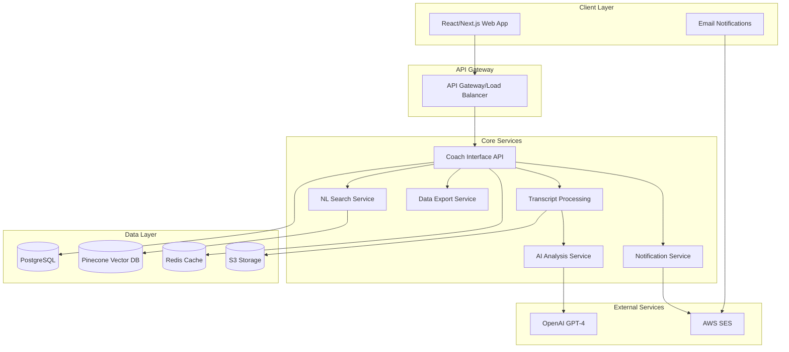
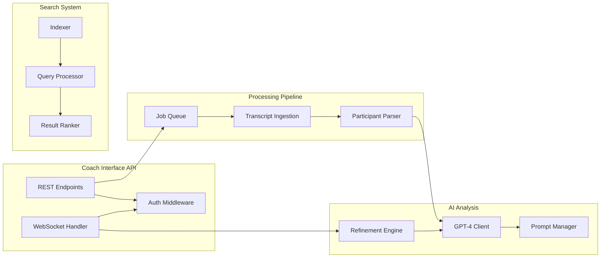
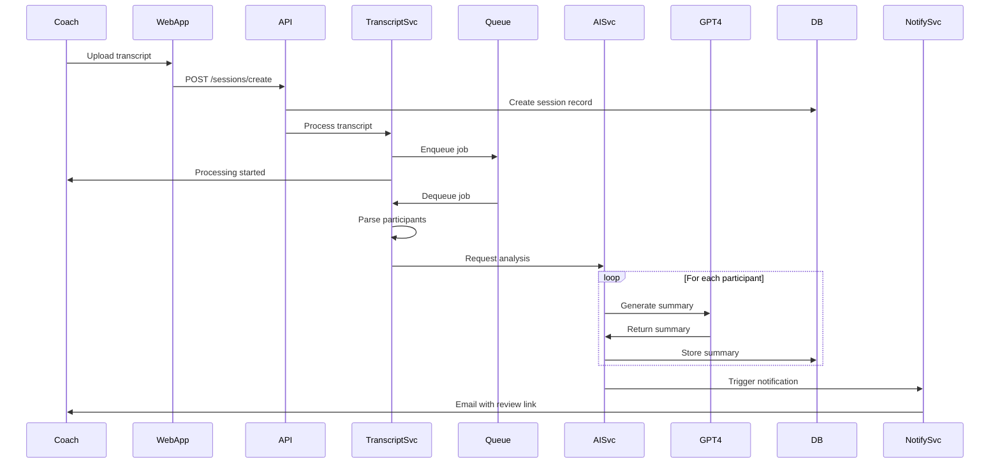
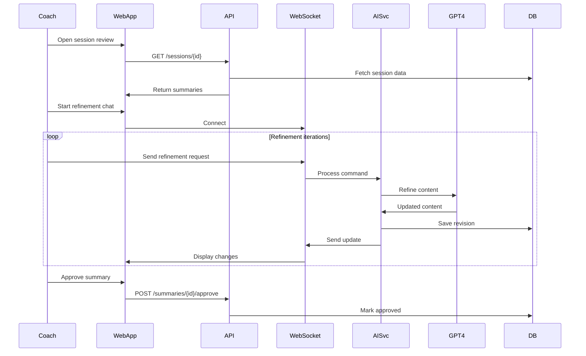
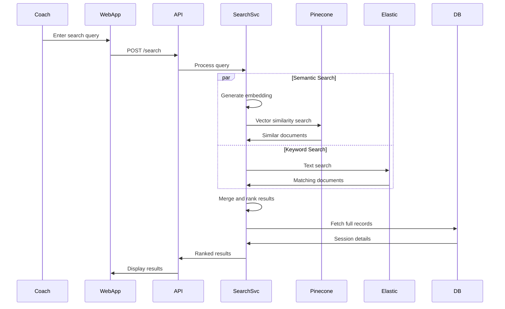

# Coaching Supervision & Automation Platform Backend Architecture Document

## Introduction

This document outlines the overall project architecture for the Coaching Supervision & Automation Platform, including backend systems, shared services, and non-UI specific concerns. Its primary goal is to serve as the guiding architectural blueprint for AI-driven development, ensuring consistency and adherence to chosen patterns and technologies.

**Relationship to Frontend Architecture:**
If the project includes a significant user interface, a separate Frontend Architecture Document will detail the frontend-specific design and MUST be used in conjunction with this document. Core technology stack choices documented herein (see "Tech Stack") are definitive for the entire project, including any frontend components.

### Starter Template or Existing Project

N/A - This is a greenfield project that will be built from scratch using the architectural patterns and technology choices defined in this document.

### Change Log

| Date | Version | Description | Author |
|------|---------|-------------|---------|
| 2025-08-16 | 1.0 | Initial backend architecture creation based on PRD and front-end spec | Winston (Architect) |

## High Level Architecture

### Technical Summary

The Coaching Supervision & Automation Platform employs a microservices-within-monorepo architecture, optimizing for rapid development while maintaining service boundaries for future scaling. The system leverages Python/FastAPI for backend services, PostgreSQL for structured data, Pinecone for vector embeddings enabling natural language search, and React/Next.js for the coach interface. Core architectural patterns include event-driven processing for transcript analysis, CQRS for separating read/write operations on coaching data, and a chat-based iterative refinement system that builds coach trust through transparent AI collaboration. This architecture directly supports the PRD goals of reducing coach administrative time by 85% while maintaining 95% AI accuracy through human-in-the-loop validation.

### High Level Overview

**Architectural Style:** Microservices within Monorepo - providing service isolation with development simplicity

**Repository Structure:** Monorepo containing all platform services, shared utilities, and infrastructure code

**Service Architecture:** 
- Transcript Processing Service - Handles ingestion and initial parsing
- AI Analysis Service - Manages GPT-4 interactions and prompt engineering  
- Natural Language Search Service - Vector search and semantic querying
- Coach Interface API - REST/WebSocket APIs for the web interface
- Notification Service - Email alerts and coach communications
- Data Export Service - CRM integration and bulk data exports

**Primary Data Flow:**
1. Coach uploads transcript → Processing pipeline extracts participants
2. AI Analysis generates summaries → Coach reviews via chat interface
3. Iterative refinement → Approved content sent to clients
4. All data indexed for natural language search

**Key Architectural Decisions:**
- Asynchronous processing for transcript analysis to handle variable loads
- Separate vector database for semantic search capabilities
- WebSocket connections for real-time chat refinement
- Event-driven architecture for service decoupling

### High Level Project Diagram



### Architectural and Design Patterns

- **Event-Driven Architecture:** Using AWS SNS/SQS for service communication - *Rationale:* Enables asynchronous processing of transcripts and decouples services for independent scaling
- **CQRS Pattern:** Separate read/write models for coaching data - *Rationale:* Optimizes natural language queries while maintaining transactional consistency for session data
- **Repository Pattern:** Abstract data access for all entities - *Rationale:* Enables testing with mocks and potential future database migrations
- **Saga Pattern:** Orchestrate multi-step transcript processing workflow - *Rationale:* Ensures reliable completion of complex AI analysis pipeline with compensation logic
- **Circuit Breaker:** For OpenAI API and external service calls - *Rationale:* Prevents cascade failures when external services are unavailable
- **Hexagonal Architecture:** Core business logic isolated from infrastructure - *Rationale:* Keeps coaching domain logic independent of technical implementation details
- **Chat-Based Command Pattern:** Natural language commands translated to system operations - *Rationale:* Enables intuitive coach interaction while maintaining structured backend processing

## Tech Stack

This is the DEFINITIVE technology selection for the entire platform. All components must use these specific versions and technologies.

### Cloud Infrastructure

- **Provider:** AWS
- **Key Services:** Lambda, API Gateway, RDS, S3, SQS/SNS, SES, CloudWatch, Secrets Manager
- **Deployment Regions:** us-east-1 (primary), us-west-2 (DR)

### Technology Stack Table

| Category | Technology | Version | Purpose | Rationale |
|----------|------------|---------|---------|-----------|
| **Language - Backend** | Python | 3.11.7 | Primary backend development | Excellent AI/ML ecosystem, FastAPI support, team expertise |
| **Language - Frontend** | TypeScript | 5.3.3 | Frontend development | Type safety, excellent tooling, React ecosystem |
| **Runtime - Backend** | Python | 3.11.7 | Backend runtime environment | Stable, performant, wide library support |
| **Runtime - Frontend** | Node.js | 20.11.0 | Frontend build and SSR | LTS version, Next.js compatibility |
| **Framework - Backend** | FastAPI | 0.109.0 | REST API and WebSocket server | High performance, automatic OpenAPI docs, WebSocket support |
| **Framework - Frontend** | Next.js | 14.1.0 | React framework with SSR | SEO optimization, excellent DX, built-in optimization |
| **UI Library** | React | 18.2.0 | User interface components | Component model, vast ecosystem, team familiarity |
| **Database - Primary** | PostgreSQL | 16.1 | Structured coaching data | JSONB support, full-text search, reliability |
| **Database - Vector** | Pinecone | - | Semantic search embeddings | Purpose-built for vector search, managed service |
| **Database - Cache** | Redis | 7.2.4 | Session cache and real-time data | WebSocket state, API response caching |
| **Message Queue** | AWS SQS | - | Asynchronous job processing | Managed service, reliable delivery, dead letter queues |
| **Event Bus** | AWS SNS | - | Service event distribution | Fan-out pattern, service decoupling |
| **Object Storage** | AWS S3 | - | Transcript and document storage | Unlimited scale, lifecycle policies, cost-effective |
| **AI/LLM Provider** | OpenAI GPT-4 | gpt-4-turbo | Transcript analysis and NL processing | Best accuracy, function calling, long context |
| **Email Service** | AWS SES | - | Coach notifications and client emails | Cost-effective, high deliverability, AWS integration |
| **Search Engine** | Elasticsearch | 8.11.3 | Full-text and tag-based search | Powerful query DSL, aggregations, faceting |
| **API Documentation** | OpenAPI/Swagger | 3.0.0 | API specification and docs | Industry standard, code generation, testing |
| **Testing - Python** | pytest | 8.0.0 | Python unit and integration tests | Powerful fixtures, excellent reporting |
| **Testing - JavaScript** | Jest | 29.7.0 | JavaScript/React testing | Snapshot testing, good React support |
| **Testing - E2E** | Playwright | 1.41.0 | End-to-end browser testing | Cross-browser support, reliable automation |
| **Monitoring** | Datadog | - | APM and infrastructure monitoring | Comprehensive observability, AI insights |
| **IaC** | Terraform | 1.7.0 | Infrastructure as code | Multi-cloud support, state management |
| **Container** | Docker | 25.0.0 | Containerization for services | Development parity, easy deployment |
| **Orchestration** | AWS ECS | - | Container orchestration | Managed service, AWS integration, Fargate support |

## Data Models

### Coach

**Purpose:** Represents coaches who use the platform to manage their sessions and clients

**Key Attributes:**
- id: UUID - Unique identifier
- email: String - Coach login and notification email  
- name: String - Display name
- organization_id: UUID - Link to coaching organization
- voice_profile: JSON - Learned communication style preferences
- notification_preferences: JSON - Email timing and frequency settings
- created_at: Timestamp - Account creation date
- last_login: Timestamp - Most recent platform access

**Relationships:**
- Has many Sessions (as facilitator)
- Has many Clients (through sessions)
- Belongs to Organization
- Has many Templates

### Session

**Purpose:** Represents a coaching session (workshop, one-on-one, etc.)

**Key Attributes:**
- id: UUID - Unique identifier
- coach_id: UUID - Facilitating coach
- session_date: Date - When session occurred
- session_type: Enum - Workshop type (group, individual, etc.)
- transcript_url: String - S3 location of original transcript
- duration_minutes: Integer - Session length
- participant_count: Integer - Number of attendees
- processing_status: Enum - Current pipeline state
- metadata: JSON - Additional session context

**Relationships:**
- Belongs to Coach
- Has many ClientSessions (participants)
- Has many Summaries
- Has one ProcessingJob

### Client

**Purpose:** Individual who participates in coaching sessions

**Key Attributes:**
- id: UUID - Unique identifier
- name: String - Client full name
- email: String - Contact email (optional)
- organization_id: UUID - Company/group affiliation
- tags: Array[String] - Categorization tags
- engagement_score: Float - Calculated participation metric
- created_at: Timestamp - First session date

**Relationships:**
- Has many ClientSessions
- Has many Summaries
- Has many FollowUps
- Belongs to Organization

### ClientSession

**Purpose:** Junction table tracking client participation in specific sessions

**Key Attributes:**
- id: UUID - Unique identifier
- client_id: UUID - Participating client
- session_id: UUID - Session attended
- speaking_time_seconds: Integer - Total speaking duration
- engagement_level: Enum - High/Medium/Low/Silent
- breakthrough_detected: Boolean - Significant progress flag
- priority_score: Float - Follow-up urgency (0-1)

**Relationships:**
- Belongs to Client
- Belongs to Session
- Has one Summary

### Summary

**Purpose:** AI-generated and coach-refined session summary for a specific client

**Key Attributes:**
- id: UUID - Unique identifier
- client_session_id: UUID - Link to client's session participation
- wins: Text - Client achievements/progress
- challenges: Text - Issues and obstacles discussed
- action_items: Array[JSON] - Structured next steps
- coach_recommendations: Text - Professional guidance
- ai_version: Text - Original AI-generated content
- coach_edited_version: Text - Human-refined content
- refinement_history: JSON - Chat interaction log
- approved_at: Timestamp - Coach approval time

**Relationships:**
- Belongs to ClientSession
- Has many FollowUps
- Has RefinementHistory

### FollowUp

**Purpose:** Email communications sent to clients post-session

**Key Attributes:**
- id: UUID - Unique identifier
- summary_id: UUID - Source summary
- client_id: UUID - Recipient
- subject: String - Email subject line
- body: Text - Email content
- template_id: UUID - Source template used
- status: Enum - Draft/Scheduled/Sent/Failed
- sent_at: Timestamp - Delivery time
- scheduled_for: Timestamp - Future send time

**Relationships:**
- Belongs to Summary
- Belongs to Client
- Uses Template

### Template

**Purpose:** Reusable formats for summaries and follow-up emails

**Key Attributes:**
- id: UUID - Unique identifier
- name: String - Template name
- type: Enum - Summary/Email/Prompt
- workshop_type: String - Associated session type
- content: Text - Template with variables
- variables: Array[String] - Required placeholders
- coach_id: UUID - Owner (null for system templates)
- is_default: Boolean - Auto-selected flag

**Relationships:**
- Belongs to Coach (optional)
- Used by many FollowUps
- Used by many Summaries

## Components

### Coach Interface API

**Responsibility:** REST and WebSocket APIs serving the React frontend, handling authentication, session management, and real-time chat interactions

**Key Interfaces:**
- REST endpoints for CRUD operations on all entities
- WebSocket endpoint for chat-based refinement sessions
- GraphQL endpoint for complex client queries (optional)
- OAuth2/JWT authentication endpoints

**Dependencies:** All other services, PostgreSQL, Redis

**Technology Stack:** FastAPI 0.109.0, Pydantic for validation, SQLAlchemy ORM, Redis for sessions

#### WebSocket Scaling Strategy

**Connection Management:**
- **Sticky Sessions:** Application Load Balancer with session affinity based on coach_id cookie
- **Connection Limits:** 10,000 concurrent WebSocket connections per server instance
- **Heartbeat:** 30-second ping/pong to detect stale connections
- **Reconnection:** Automatic client reconnection with exponential backoff (1s, 2s, 4s, 8s, max 30s)

**Horizontal Scaling Architecture:**
- **Redis Pub/Sub:** Cross-server message broadcasting for multi-instance deployments
- **Connection Registry:** Redis-based registry tracking coach_id → server_instance mappings
- **Session State:** All chat session state stored in Redis, not in-memory
- **Message Queue:** Redis Streams for reliable message delivery and replay capability

**Performance Optimization:**
- **Message Batching:** Aggregate multiple updates within 100ms window
- **Compression:** WebSocket compression enabled (permessage-deflate)
- **Binary Protocol:** MessagePack for efficient serialization (30% smaller than JSON)
- **Rate Limiting:** 10 messages/second per connection to prevent abuse

**High Availability:**
- **Health Checks:** WebSocket-specific health endpoint testing connection establishment
- **Graceful Shutdown:** 30-second drain period for existing connections
- **Connection Migration:** Transfer active sessions to healthy instances on failure
- **Circuit Breaker:** Temporary disable new connections when CPU > 80%

**Monitoring:**
- **Metrics:** Connection count, message rate, latency P50/P95/P99
- **Alerts:** Connection spike detection, abnormal disconnection rate
- **Dashboard:** Real-time WebSocket metrics in Datadog

### Transcript Processing Service

**Responsibility:** Ingest transcripts from multiple sources, extract participants, parse speaking segments, and prepare for AI analysis

**Key Interfaces:**
- POST /transcripts/upload - Direct file upload
- POST /transcripts/process - Trigger processing for stored transcript
- GET /transcripts/{id}/status - Processing status

**Dependencies:** S3 for storage, SQS for job queue

**Technology Stack:** Python 3.11.7, boto3 for AWS, transcript parsing libraries

### AI Analysis Service  

**Responsibility:** Manage OpenAI GPT-4 interactions, prompt engineering, voice learning, and iterative refinement logic

**Key Interfaces:**
- POST /analyze/session - Generate initial summaries
- POST /analyze/refine - Process refinement commands
- POST /analyze/voice/train - Update coach voice profile
- GET /analyze/prompts - Retrieve prompt templates

**Dependencies:** OpenAI API, PostgreSQL for prompts, S3 for context storage

**Technology Stack:** Python 3.11.7, OpenAI SDK, LangChain for prompt management

### Natural Language Search Service

**Responsibility:** Index coaching data in vector database, handle semantic queries, return relevant results

**Key Interfaces:**
- POST /search/query - Natural language search
- POST /search/index - Index new content
- GET /search/suggest - Query suggestions
- POST /search/similar - Find similar sessions

**Dependencies:** Pinecone for vectors, Elasticsearch for text search

**Technology Stack:** Python 3.11.7, Pinecone SDK, Elasticsearch client, sentence-transformers

### Notification Service

**Responsibility:** Manage email notifications to coaches and clients, handle templates and scheduling

**Key Interfaces:**
- POST /notifications/send - Send immediate email
- POST /notifications/schedule - Schedule future send
- GET /notifications/status - Delivery status
- POST /notifications/batch - Bulk email operations

**Dependencies:** AWS SES, PostgreSQL for templates

**Technology Stack:** Python 3.11.7, boto3 for SES, Jinja2 for templates

### Data Export Service

**Responsibility:** Generate standardized exports for CRM integration and reporting

**Key Interfaces:**
- POST /export/json - Generate JSON export
- POST /export/csv - Generate CSV export  
- GET /export/schemas - Available export schemas
- POST /export/schedule - Recurring export jobs

**Dependencies:** PostgreSQL, S3 for export storage

**Technology Stack:** Python 3.11.7, pandas for data manipulation, Apache Arrow for efficient serialization

### Component Diagrams



## External APIs

### OpenAI GPT-4 API

- **Purpose:** Generate coaching summaries, handle natural language refinement, extract insights from transcripts
- **Documentation:** https://platform.openai.com/docs/api-reference
- **Base URL(s):** https://api.openai.com/v1
- **Authentication:** Bearer token (API key stored in AWS Secrets Manager)
- **Rate Limits:** 10,000 RPM, 2,000,000 TPM for GPT-4 Turbo

**Key Endpoints Used:**
- `POST /chat/completions` - Generate summaries and process refinements
- `POST /embeddings` - Create vector embeddings for semantic search

**Integration Notes:** Implement exponential backoff for rate limits, use streaming for long responses, maintain prompt version control

### AWS SES API

- **Purpose:** Send notification emails to coaches and follow-up emails to clients
- **Documentation:** https://docs.aws.amazon.com/ses/latest/APIReference/
- **Base URL(s):** https://email.us-east-1.amazonaws.com
- **Authentication:** AWS IAM role-based authentication
- **Rate Limits:** 14 emails/second (adjustable based on reputation)

**Key Endpoints Used:**
- `POST /` (SendEmail action) - Send individual emails
- `POST /` (SendBulkTemplatedEmail action) - Batch email operations

**Integration Notes:** Configure SPF/DKIM for deliverability, handle bounces via SNS, implement retry logic for throttling

### Pinecone Vector Database API

- **Purpose:** Store and query vector embeddings for semantic search across coaching sessions
- **Documentation:** https://docs.pinecone.io/reference
- **Base URL(s):** https://[index-name]-[project-id].svc.[environment].pinecone.io
- **Authentication:** API key authentication
- **Rate Limits:** Based on subscription tier

**Key Endpoints Used:**
- `POST /vectors/upsert` - Store coaching content embeddings
- `POST /query` - Semantic similarity search
- `POST /vectors/delete` - Remove outdated embeddings

**Integration Notes:** Batch operations for efficiency, implement local caching for frequent queries, monitor index usage

## Core Workflows

### Session Processing Workflow



### Iterative Refinement Workflow



### Natural Language Search Workflow



## REST API Spec

```yaml
openapi: 3.0.0
info:
  title: Coaching Platform API
  version: 1.0.0
  description: Backend API for the Coaching Supervision & Automation Platform
servers:
  - url: https://api.coachingplatform.com/v1
    description: Production server
  - url: http://localhost:8000/v1
    description: Development server

paths:
  /auth/login:
    post:
      summary: Authenticate coach
      requestBody:
        content:
          application/json:
            schema:
              type: object
              properties:
                email:
                  type: string
                password:
                  type: string
      responses:
        200:
          description: Successful authentication
          content:
            application/json:
              schema:
                type: object
                properties:
                  access_token:
                    type: string
                  refresh_token:
                    type: string
                  
  /sessions:
    get:
      summary: List coaching sessions
      parameters:
        - name: coach_id
          in: query
          schema:
            type: string
        - name: date_from
          in: query
          schema:
            type: string
            format: date
      responses:
        200:
          description: List of sessions
          content:
            application/json:
              schema:
                type: array
                items:
                  $ref: '#/components/schemas/Session'
    
    post:
      summary: Create new session
      requestBody:
        content:
          multipart/form-data:
            schema:
              type: object
              properties:
                transcript:
                  type: string
                  format: binary
                session_type:
                  type: string
                session_date:
                  type: string
                  format: date
      responses:
        201:
          description: Session created
          
  /sessions/{id}/summaries:
    get:
      summary: Get session summaries
      parameters:
        - name: id
          in: path
          required: true
          schema:
            type: string
      responses:
        200:
          description: Session summaries
          content:
            application/json:
              schema:
                type: array
                items:
                  $ref: '#/components/schemas/Summary'
                  
  /summaries/{id}/refine:
    post:
      summary: Refine summary via chat
      parameters:
        - name: id
          in: path
          required: true
          schema:
            type: string
      requestBody:
        content:
          application/json:
            schema:
              type: object
              properties:
                command:
                  type: string
                context:
                  type: object
      responses:
        200:
          description: Refined summary
          
  /search:
    post:
      summary: Natural language search
      requestBody:
        content:
          application/json:
            schema:
              type: object
              properties:
                query:
                  type: string
                filters:
                  type: object
      responses:
        200:
          description: Search results
          
components:
  schemas:
    Session:
      type: object
      properties:
        id:
          type: string
        coach_id:
          type: string
        session_date:
          type: string
          format: date
        session_type:
          type: string
        participant_count:
          type: integer
        processing_status:
          type: string
          
    Summary:
      type: object
      properties:
        id:
          type: string
        client_name:
          type: string
        wins:
          type: string
        challenges:
          type: string
        action_items:
          type: array
          items:
            type: string
        coach_recommendations:
          type: string
```

## Database Schema

### PostgreSQL Schema

```sql
-- Core Tables
CREATE TABLE organizations (
    id UUID PRIMARY KEY DEFAULT gen_random_uuid(),
    name VARCHAR(255) NOT NULL,
    settings JSONB DEFAULT '{}',
    created_at TIMESTAMP DEFAULT CURRENT_TIMESTAMP
);

CREATE TABLE coaches (
    id UUID PRIMARY KEY DEFAULT gen_random_uuid(),
    email VARCHAR(255) UNIQUE NOT NULL,
    name VARCHAR(255) NOT NULL,
    organization_id UUID REFERENCES organizations(id),
    voice_profile JSONB DEFAULT '{}',
    notification_preferences JSONB DEFAULT '{}',
    created_at TIMESTAMP DEFAULT CURRENT_TIMESTAMP,
    last_login TIMESTAMP
);

CREATE TABLE sessions (
    id UUID PRIMARY KEY DEFAULT gen_random_uuid(),
    coach_id UUID REFERENCES coaches(id),
    session_date DATE NOT NULL,
    session_type VARCHAR(50) NOT NULL,
    transcript_url TEXT,
    duration_minutes INTEGER,
    participant_count INTEGER,
    processing_status VARCHAR(50) DEFAULT 'pending',
    metadata JSONB DEFAULT '{}',
    created_at TIMESTAMP DEFAULT CURRENT_TIMESTAMP,
    INDEX idx_sessions_coach_date (coach_id, session_date)
);

CREATE TABLE clients (
    id UUID PRIMARY KEY DEFAULT gen_random_uuid(),
    name VARCHAR(255) NOT NULL,
    email VARCHAR(255),
    organization_id UUID REFERENCES organizations(id),
    tags TEXT[],
    engagement_score DECIMAL(3,2),
    created_at TIMESTAMP DEFAULT CURRENT_TIMESTAMP,
    INDEX idx_clients_org (organization_id)
);

CREATE TABLE client_sessions (
    id UUID PRIMARY KEY DEFAULT gen_random_uuid(),
    client_id UUID REFERENCES clients(id),
    session_id UUID REFERENCES sessions(id),
    speaking_time_seconds INTEGER,
    engagement_level VARCHAR(20),
    breakthrough_detected BOOLEAN DEFAULT FALSE,
    priority_score DECIMAL(3,2),
    UNIQUE(client_id, session_id)
);

CREATE TABLE summaries (
    id UUID PRIMARY KEY DEFAULT gen_random_uuid(),
    client_session_id UUID REFERENCES client_sessions(id),
    wins TEXT,
    challenges TEXT,
    action_items JSONB,
    coach_recommendations TEXT,
    ai_version TEXT,
    coach_edited_version TEXT,
    refinement_history JSONB DEFAULT '[]',
    approved_at TIMESTAMP,
    created_at TIMESTAMP DEFAULT CURRENT_TIMESTAMP
);

CREATE TABLE templates (
    id UUID PRIMARY KEY DEFAULT gen_random_uuid(),
    name VARCHAR(255) NOT NULL,
    type VARCHAR(50) NOT NULL,
    workshop_type VARCHAR(100),
    content TEXT NOT NULL,
    variables TEXT[],
    coach_id UUID REFERENCES coaches(id),
    is_default BOOLEAN DEFAULT FALSE,
    created_at TIMESTAMP DEFAULT CURRENT_TIMESTAMP
);

CREATE TABLE follow_ups (
    id UUID PRIMARY KEY DEFAULT gen_random_uuid(),
    summary_id UUID REFERENCES summaries(id),
    client_id UUID REFERENCES clients(id),
    subject VARCHAR(500),
    body TEXT,
    template_id UUID REFERENCES templates(id),
    status VARCHAR(50) DEFAULT 'draft',
    sent_at TIMESTAMP,
    scheduled_for TIMESTAMP,
    created_at TIMESTAMP DEFAULT CURRENT_TIMESTAMP
);

-- Indexes for performance
CREATE INDEX idx_summaries_approved ON summaries(approved_at) WHERE approved_at IS NOT NULL;
CREATE INDEX idx_follow_ups_status ON follow_ups(status);
CREATE INDEX idx_sessions_processing ON sessions(processing_status);

-- Full text search
ALTER TABLE summaries ADD COLUMN search_vector tsvector;
CREATE INDEX idx_summaries_search ON summaries USING GIN(search_vector);

-- Trigger to update search vector
CREATE TRIGGER summaries_search_update
BEFORE INSERT OR UPDATE ON summaries
FOR EACH ROW EXECUTE FUNCTION
tsvector_update_trigger(search_vector, 'pg_catalog.english', wins, challenges, coach_recommendations);
```

### Vector Database Schema (Pinecone)

```json
{
  "index_name": "coaching-sessions",
  "dimension": 1536,
  "metric": "cosine",
  "metadata_config": {
    "indexed": [
      "coach_id",
      "client_id",
      "session_date",
      "session_type",
      "tags"
    ]
  },
  "vector_schema": {
    "id": "summary_id",
    "values": "[1536-dimensional embedding]",
    "metadata": {
      "coach_id": "uuid",
      "client_id": "uuid",
      "session_id": "uuid",
      "session_date": "date",
      "session_type": "string",
      "content_type": "wins|challenges|actions|recommendations",
      "text_preview": "first 200 chars"
    }
  }
}
```

### Vector Database Backup & Recovery Strategy

**Backup Architecture:**
- **Dual Indexing:** Simultaneous indexing to Pinecone (primary) and Elasticsearch (backup)
- **Source of Truth:** PostgreSQL stores original text + embeddings as JSONB
- **Backup Frequency:** Real-time dual writes, daily full export to S3
- **Export Format:** Parquet files with embeddings + metadata, partitioned by date

**Backup Implementation:**
```python
# Backup Process (runs daily via AWS Lambda)
1. Query PostgreSQL for all summaries with embeddings
2. Export to Parquet format with schema versioning
3. Upload to S3 with lifecycle policies (90-day retention)
4. Verify backup integrity with checksums
5. Update backup catalog in DynamoDB
```

**Recovery Procedures:**
- **Partial Recovery (< 1 hour outage):**
  - Replay from PostgreSQL for missing vectors
  - Use Elasticsearch as temporary search fallback
  - Re-index affected summaries from source data
  
- **Full Recovery (complete index loss):**
  - Create new Pinecone index with same configuration
  - Restore from latest S3 Parquet backup
  - Replay any changes from PostgreSQL WAL since backup
  - Verify index completeness with reconciliation job

**Redundancy Strategy:**
- **Multi-Region:** Secondary Pinecone index in us-west-2 (async replication)
- **Fallback Search:** Elasticsearch with degraded semantic capability
- **Cache Layer:** Redis caches frequent search results (24-hour TTL)
- **Circuit Breaker:** Auto-switch to Elasticsearch if Pinecone latency > 2s

**Monitoring & Validation:**
- **Index Health:** Monitor vector count, query latency, error rates
- **Backup Validation:** Daily automated restore test to staging index
- **Data Integrity:** Checksum validation on all backups
- **Alert Thresholds:** Index size deviation > 5%, query failure rate > 0.1%

**Cost Optimization:**
- **Incremental Backups:** Only changed vectors after initial full backup
- **Compression:** Zstandard compression for S3 storage (60% reduction)
- **Lifecycle Policies:** Move to Glacier after 30 days, delete after 1 year
- **On-Demand Indexing:** Re-generate embeddings from text if needed

## Source Tree

```plaintext
coaching-platform/
├── packages/
│   ├── api/                           # Coach Interface API
│   │   ├── src/
│   │   │   ├── auth/                  # Authentication/authorization
│   │   │   ├── routes/                # REST endpoints
│   │   │   ├── websocket/             # WebSocket handlers
│   │   │   ├── models/                # SQLAlchemy models
│   │   │   ├── schemas/               # Pydantic schemas
│   │   │   ├── repositories/          # Data access layer
│   │   │   └── main.py                # FastAPI app
│   │   ├── tests/
│   │   └── requirements.txt
│   │
│   ├── transcript-processor/           # Transcript Processing Service
│   │   ├── src/
│   │   │   ├── parsers/               # Transcript format parsers
│   │   │   ├── extractors/            # Participant extraction
│   │   │   ├── queue/                 # SQS handlers
│   │   │   └── main.py
│   │   └── tests/
│   │
│   ├── ai-analysis/                   # AI Analysis Service
│   │   ├── src/
│   │   │   ├── prompts/               # Prompt templates
│   │   │   ├── refinement/            # Iterative refinement
│   │   │   ├── voice/                 # Voice learning
│   │   │   ├── clients/               # OpenAI client
│   │   │   └── main.py
│   │   └── tests/
│   │
│   ├── search/                        # Natural Language Search Service
│   │   ├── src/
│   │   │   ├── indexers/              # Content indexing
│   │   │   ├── query/                 # Query processing
│   │   │   ├── ranking/               # Result ranking
│   │   │   └── main.py
│   │   └── tests/
│   │
│   ├── notifications/                 # Notification Service
│   │   ├── src/
│   │   │   ├── templates/             # Email templates
│   │   │   ├── scheduler/             # Send scheduling
│   │   │   ├── ses/                   # AWS SES client
│   │   │   └── main.py
│   │   └── tests/
│   │
│   ├── export/                        # Data Export Service
│   │   ├── src/
│   │   │   ├── formats/               # JSON/CSV formatters
│   │   │   ├── schemas/               # Export schemas
│   │   │   └── main.py
│   │   └── tests/
│   │
│   ├── web/                           # React/Next.js Frontend
│   │   ├── src/
│   │   │   ├── components/            # React components
│   │   │   ├── pages/                 # Next.js pages
│   │   │   ├── hooks/                 # Custom React hooks
│   │   │   ├── services/              # API clients
│   │   │   └── styles/                # CSS/styling
│   │   ├── public/
│   │   └── package.json
│   │
│   └── shared/                        # Shared utilities
│       ├── src/
│       │   ├── types/                 # Shared TypeScript types
│       │   ├── constants/             # Shared constants
│       │   └── utils/                 # Utility functions
│       └── package.json
│
├── infrastructure/                    # Infrastructure as Code
│   ├── terraform/
│   │   ├── modules/                   # Reusable Terraform modules
│   │   ├── environments/              # Environment-specific configs
│   │   └── main.tf
│   └── docker/                        # Docker configurations
│       ├── api.Dockerfile
│       └── docker-compose.yml
│
├── scripts/                           # Development and deployment scripts
│   ├── setup.sh                       # Initial setup
│   ├── deploy.sh                      # Deployment script
│   └── test.sh                        # Run all tests
│
├── docs/                              # Documentation
│   ├── architecture.md
│   ├── api.md
│   └── deployment.md
│
├── .github/                           # GitHub Actions workflows
│   └── workflows/
│       ├── ci.yml
│       └── deploy.yml
│
├── pyproject.toml                     # Python project configuration
├── package.json                       # Root package.json for monorepo
├── .env.example                       # Environment variables template
└── README.md
```

## Infrastructure and Deployment

### Infrastructure as Code

- **Tool:** Terraform 1.7.0
- **Location:** `infrastructure/terraform/`
- **Approach:** Modular Terraform with separate modules for each AWS service, environment-specific variables

### Deployment Strategy

- **Strategy:** Blue-Green deployment with automated rollback
- **CI/CD Platform:** GitHub Actions
- **Pipeline Configuration:** `.github/workflows/deploy.yml`

### Environments

- **Development:** Local Docker Compose environment for rapid iteration - Uses LocalStack for AWS services
- **Staging:** AWS ECS on Fargate with reduced capacity - Full integration with external services
- **Production:** AWS ECS on Fargate with auto-scaling - Multi-AZ deployment for high availability

### Environment Promotion Flow

```text
Local Development
    ↓ (git push)
CI/CD Pipeline
    ↓ (automated tests pass)
Staging Environment
    ↓ (manual approval + smoke tests)
Production Environment
    ↓ (canary deployment 10%)
Full Production Rollout
```

### Rollback Strategy

- **Primary Method:** Automated rollback on health check failures
- **Trigger Conditions:** 5XX error rate > 1%, P95 latency > 3s, Failed health checks
- **Recovery Time Objective:** < 5 minutes for automated rollback

## Error Handling Strategy

### General Approach

- **Error Model:** Structured error responses with error codes and user-friendly messages
- **Exception Hierarchy:** Custom exceptions inheriting from base ApplicationError class
- **Error Propagation:** Errors bubble up to API layer for consistent client responses

### Logging Standards

- **Library:** structlog 24.1.0
- **Format:** JSON structured logging
- **Levels:** DEBUG, INFO, WARNING, ERROR, CRITICAL
- **Required Context:**
  - Correlation ID: UUID for request tracing
  - Service Context: service_name, version, environment
  - User Context: coach_id (never log PII)

### Error Handling Patterns

#### External API Errors

- **Retry Policy:** Exponential backoff with jitter, max 3 retries
- **Circuit Breaker:** Open after 5 consecutive failures, half-open after 30s
- **Timeout Configuration:** OpenAI: 30s, AWS services: 10s
- **Error Translation:** Map external errors to internal error codes

#### Business Logic Errors

- **Custom Exceptions:** ValidationError, AuthorizationError, ResourceNotFoundError
- **User-Facing Errors:** Sanitized messages without technical details
- **Error Codes:** COACH_001-999 series for consistent client handling

#### Data Consistency

- **Transaction Strategy:** Database transactions with automatic rollback
- **Compensation Logic:** Saga pattern for multi-service operations
- **Idempotency:** UUID-based idempotency keys for critical operations

## Coding Standards

### Core Standards

- **Languages & Runtimes:** Python 3.11.7, TypeScript 5.3.3, Node.js 20.11.0
- **Style & Linting:** Black + Ruff for Python, ESLint + Prettier for TypeScript
- **Test Organization:** Tests in `tests/` directory mirroring source structure

### Naming Conventions

| Element | Convention | Example |
|---------|------------|---------|
| Python Classes | PascalCase | `CoachService` |
| Python Functions | snake_case | `process_transcript` |
| TypeScript Classes | PascalCase | `SessionCard` |
| TypeScript Functions | camelCase | `generateSummary` |
| Database Tables | snake_case plural | `client_sessions` |
| API Endpoints | kebab-case | `/api/v1/coach-sessions` |
| Environment Variables | UPPER_SNAKE_CASE | `DATABASE_URL` |

### Critical Rules

- **No Direct Database Access:** All database operations must go through repository pattern
- **API Response Wrapper:** All API responses must use standardized ApiResponse type
- **No Hardcoded Secrets:** All secrets must come from AWS Secrets Manager
- **Async by Default:** Use async/await for all I/O operations
- **Type Everything:** No `any` types in TypeScript, use Pydantic models in Python
- **Log Correlation IDs:** Every log entry must include request correlation ID
- **Test Before Commit:** Minimum 80% code coverage for new code

## Test Strategy and Standards

### Testing Philosophy

- **Approach:** Test-Driven Development (TDD) for critical business logic
- **Coverage Goals:** 80% overall, 90% for business logic, 70% for infrastructure
- **Test Pyramid:** 60% unit, 30% integration, 10% E2E

### Test Types and Organization

#### Unit Tests

- **Framework:** pytest 8.0.0
- **File Convention:** `test_[module_name].py`
- **Location:** `tests/unit/` within each service
- **Mocking Library:** pytest-mock
- **Coverage Requirement:** 90% for business logic

**AI Agent Requirements:**
- Generate tests for all public methods
- Cover edge cases and error conditions
- Follow AAA pattern (Arrange, Act, Assert)
- Mock all external dependencies

#### Integration Tests

- **Scope:** Service boundaries and database interactions
- **Location:** `tests/integration/` within each service
- **Test Infrastructure:**
  - **Database:** Testcontainers PostgreSQL
  - **Message Queue:** LocalStack SQS
  - **External APIs:** VCR.py for recording/replaying

#### End-to-End Tests

- **Framework:** Playwright 1.41.0
- **Scope:** Critical user journeys (session upload, refinement, search)
- **Environment:** Staging environment with test data
- **Test Data:** Dedicated test organization with synthetic data

### Test Data Management

- **Strategy:** Factories for test data generation
- **Fixtures:** `tests/fixtures/` for static test data
- **Factories:** Factory pattern using Factory Boy
- **Cleanup:** Automatic cleanup after each test run

### Continuous Testing

- **CI Integration:** Run on every PR, block merge on failure
- **Performance Tests:** Locust for load testing critical endpoints
- **Security Tests:** Bandit for Python, npm audit for JavaScript

## Security

### Input Validation

- **Validation Library:** Pydantic for Python, Zod for TypeScript
- **Validation Location:** API boundary before any processing
- **Required Rules:**
  - All external inputs MUST be validated
  - Validation at API boundary before processing
  - Whitelist approach preferred over blacklist

### Authentication & Authorization

- **Auth Method:** JWT with refresh tokens
- **Session Management:** Redis-backed sessions with 24h expiry
- **Required Patterns:**
  - Role-based access control (Coach, Coach Lead, Admin)
  - Organization-level data isolation
  - API key authentication for service-to-service

### Secrets Management

- **Development:** .env files (never committed)
- **Production:** AWS Secrets Manager
- **Code Requirements:**
  - NEVER hardcode secrets
  - Access via configuration service only
  - No secrets in logs or error messages

### API Security

- **Rate Limiting:** 100 requests/minute per coach
- **CORS Policy:** Configured for frontend domain only
- **Security Headers:** X-Frame-Options, CSP, HSTS
- **HTTPS Enforcement:** TLS 1.3 only, redirect all HTTP

### Data Protection

- **Encryption at Rest:** AWS RDS encryption, S3 server-side encryption
- **Encryption in Transit:** TLS 1.3 for all connections
- **PII Handling:** Mask client emails in logs, encrypt in database
- **Logging Restrictions:** Never log passwords, tokens, or full transcripts

### Dependency Security

- **Scanning Tool:** Snyk for vulnerability scanning
- **Update Policy:** Monthly security updates, immediate for critical
- **Approval Process:** Security review for new dependencies

### Security Testing

- **SAST Tool:** Semgrep for code analysis
- **DAST Tool:** OWASP ZAP for API testing
- **Penetration Testing:** Quarterly third-party assessment

### HIPAA Compliance (Health Coaching Context)

- **Administrative Safeguards:**
  - Business Associate Agreements (BAA) with AWS and all third-party services
  - Workforce training on PHI handling procedures
  - Access control policies with role-based permissions
  - Audit logs for all PHI access and modifications
  - Incident response plan for potential breaches

- **Physical Safeguards:**
  - AWS data center physical security (inherited)
  - Workstation security policies for coaches
  - Device encryption requirements for mobile access

- **Technical Safeguards:**
  - Access Control: Multi-factor authentication (MFA) required for all coach accounts
  - Audit Controls: CloudTrail for infrastructure, application-level audit logs for PHI access
  - Integrity Controls: Checksums for transcript storage, database transaction logs
  - Transmission Security: TLS 1.3 minimum, VPN for administrative access
  - Encryption Standards: AES-256 for data at rest, TLS 1.3 for transit

- **PHI Data Handling:**
  - Client health information classification and tagging
  - Automatic PHI detection in transcripts using NLP
  - Data retention: 7 years per HIPAA requirements
  - Data disposal: Secure deletion with audit trail
  - Minimum necessary access principle enforced

- **Breach Notification:**
  - Automated detection of unauthorized access attempts
  - 60-day breach notification compliance workflow
  - Breach risk assessment documentation system

## Next Steps

### Frontend Architecture

Since this project includes a comprehensive React/Next.js user interface as defined in the front-end specification, the next step is to create a detailed Frontend Architecture Document using the Frontend Architecture mode.

**Frontend Architect Prompt:**
Create the Frontend Architecture Document for the Coaching Supervision & Automation Platform using:
- This backend architecture document as the technical foundation
- The front-end specification (front-end-spec.md) for UI/UX requirements
- Focus on the React/Next.js implementation with TypeScript
- Detail the chat-based refinement interface using WebSockets
- Specify component architecture for the iterative AI collaboration workflow
- Ensure alignment with the backend API specifications defined here

### Implementation Steps

1. Complete Frontend Architecture Document
2. Set up development environment with Docker Compose
3. Initialize Terraform infrastructure for development
4. Implement Epic 1 stories starting with database schema
5. Deploy to staging environment for validation