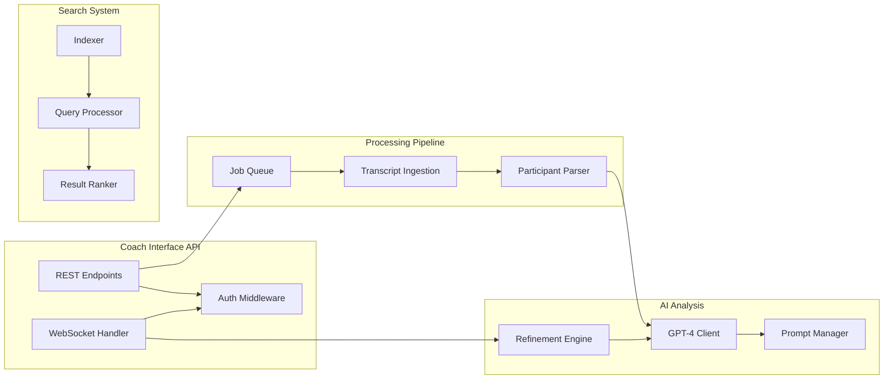

# Components

## Coach Interface API

**Responsibility:** REST and WebSocket APIs serving the React frontend, handling authentication, session management, and real-time chat interactions

**Key Interfaces:**
- REST endpoints for CRUD operations on all entities
- WebSocket endpoint for chat-based refinement sessions
- GraphQL endpoint for complex client queries (optional)
- OAuth2/JWT authentication endpoints

**Dependencies:** All other services, PostgreSQL, Redis

**Technology Stack:** FastAPI 0.109.0, Pydantic for validation, SQLAlchemy ORM, Redis for sessions

### WebSocket Scaling Strategy

**Connection Management:**
- **Sticky Sessions:** Application Load Balancer with session affinity based on coach_id cookie
- **Connection Limits:** 10,000 concurrent WebSocket connections per server instance
- **Heartbeat:** 30-second ping/pong to detect stale connections
- **Reconnection:** Automatic client reconnection with exponential backoff (1s, 2s, 4s, 8s, max 30s)

**Horizontal Scaling Architecture:**
- **Redis Pub/Sub:** Cross-server message broadcasting for multi-instance deployments
- **Connection Registry:** Redis-based registry tracking coach_id → server_instance mappings
- **Session State:** All chat session state stored in Redis, not in-memory
- **Message Queue:** Redis Streams for reliable message delivery and replay capability

**Performance Optimization:**
- **Message Batching:** Aggregate multiple updates within 100ms window
- **Compression:** WebSocket compression enabled (permessage-deflate)
- **Binary Protocol:** MessagePack for efficient serialization (30% smaller than JSON)
- **Rate Limiting:** 10 messages/second per connection to prevent abuse

**High Availability:**
- **Health Checks:** WebSocket-specific health endpoint testing connection establishment
- **Graceful Shutdown:** 30-second drain period for existing connections
- **Connection Migration:** Transfer active sessions to healthy instances on failure
- **Circuit Breaker:** Temporary disable new connections when CPU > 80%

**Monitoring:**
- **Metrics:** Connection count, message rate, latency P50/P95/P99
- **Alerts:** Connection spike detection, abnormal disconnection rate
- **Dashboard:** Real-time WebSocket metrics in Datadog

## Transcript Processing Service

**Responsibility:** Ingest transcripts from multiple sources, extract participants, parse speaking segments, and prepare for AI analysis

**Key Interfaces:**
- POST /transcripts/upload - Direct file upload
- POST /transcripts/process - Trigger processing for stored transcript
- GET /transcripts/{id}/status - Processing status

**Dependencies:** S3 for storage, SQS for job queue

**Technology Stack:** Python 3.11.7, boto3 for AWS, transcript parsing libraries

## AI Analysis Service  

**Responsibility:** Manage OpenAI GPT-4 interactions, prompt engineering, voice learning, and iterative refinement logic

**Key Interfaces:**
- POST /analyze/session - Generate initial summaries
- POST /analyze/refine - Process refinement commands
- POST /analyze/voice/train - Update coach voice profile
- GET /analyze/prompts - Retrieve prompt templates

**Dependencies:** OpenAI API, PostgreSQL for prompts, S3 for context storage

**Technology Stack:** Python 3.11.7, OpenAI SDK, LangChain for prompt management

## Natural Language Search Service

**Responsibility:** Index coaching data in vector database, handle semantic queries, return relevant results

**Key Interfaces:**
- POST /search/query - Natural language search
- POST /search/index - Index new content
- GET /search/suggest - Query suggestions
- POST /search/similar - Find similar sessions

**Dependencies:** Pinecone for vectors, Elasticsearch for text search

**Technology Stack:** Python 3.11.7, Pinecone SDK, Elasticsearch client, sentence-transformers

## Notification Service

**Responsibility:** Manage email notifications to coaches and clients, handle templates and scheduling

**Key Interfaces:**
- POST /notifications/send - Send immediate email
- POST /notifications/schedule - Schedule future send
- GET /notifications/status - Delivery status
- POST /notifications/batch - Bulk email operations

**Dependencies:** AWS SES, PostgreSQL for templates

**Technology Stack:** Python 3.11.7, boto3 for SES, Jinja2 for templates

## Data Export Service

**Responsibility:** Generate standardized exports for CRM integration and reporting

**Key Interfaces:**
- POST /export/json - Generate JSON export
- POST /export/csv - Generate CSV export  
- GET /export/schemas - Available export schemas
- POST /export/schedule - Recurring export jobs

**Dependencies:** PostgreSQL, S3 for export storage

**Technology Stack:** Python 3.11.7, pandas for data manipulation, Apache Arrow for efficient serialization

## Component Diagrams

