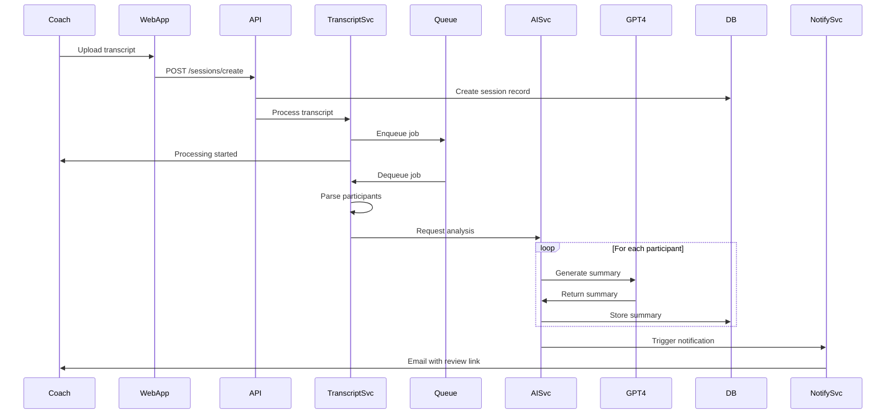
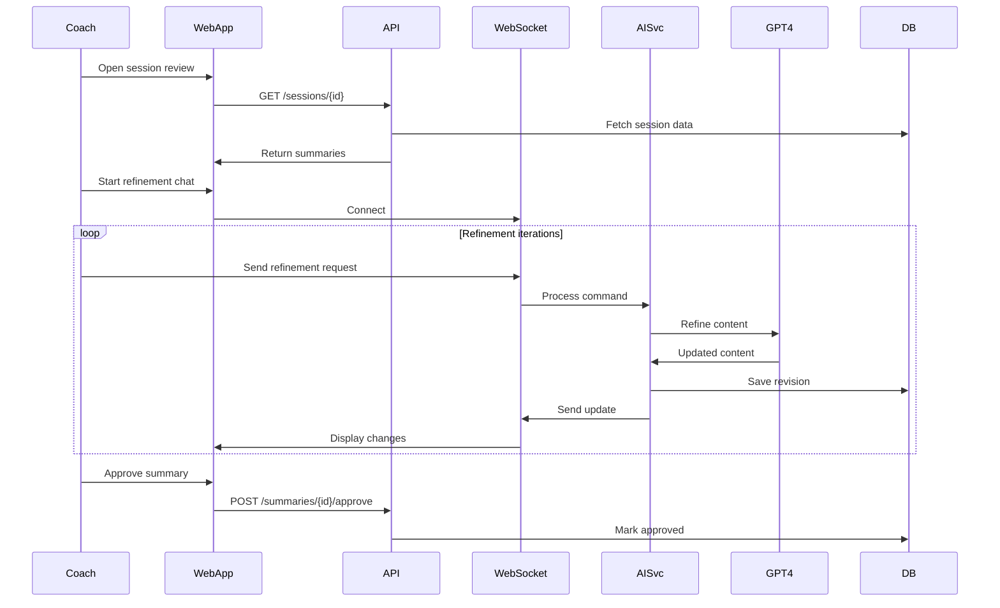
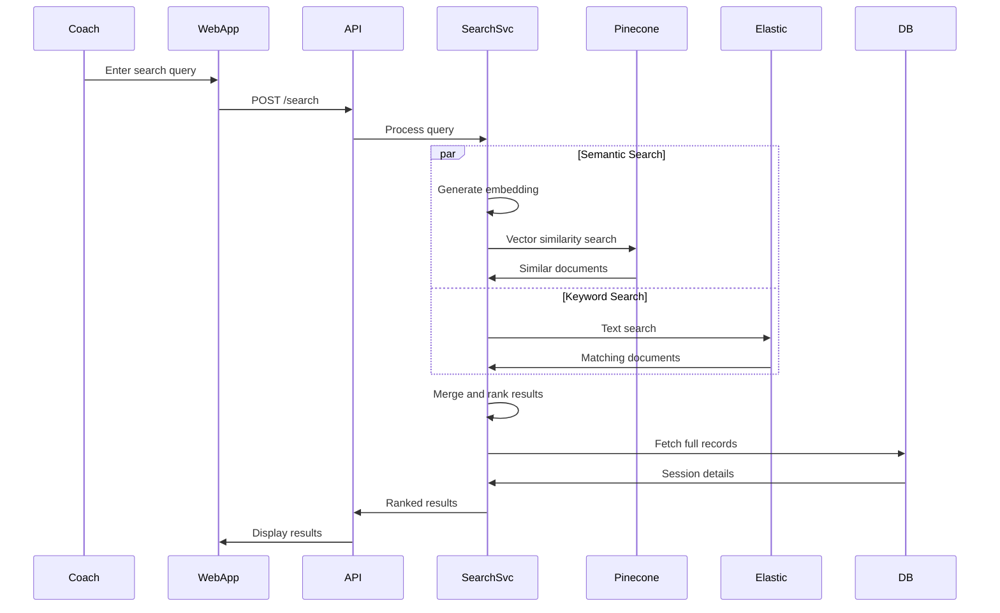

# Core Workflows

## Session Processing Workflow

```mermaid
sequenceDiagram
    participant Coach
    participant WebApp
    participant API
    participant TranscriptSvc
    participant Queue
    participant AISvc
    participant GPT4
    participant DB
    participant NotifySvc
    
    Coach->>WebApp: Upload transcript
    WebApp->>API: POST /sessions/create
    API->>DB: Create session record
    API->>TranscriptSvc: Process transcript
    TranscriptSvc->>Queue: Enqueue job
    TranscriptSvc->>Coach: Processing started
    
    Queue->>TranscriptSvc: Dequeue job
    TranscriptSvc->>TranscriptSvc: Parse participants
    TranscriptSvc->>AISvc: Request analysis
    
    loop For each participant
        AISvc->>GPT4: Generate summary
        GPT4->>AISvc: Return summary
        AISvc->>DB: Store summary
    end
    
    AISvc->>NotifySvc: Trigger notification
    NotifySvc->>Coach: Email with review link
```

## Iterative Refinement Workflow

```mermaid
sequenceDiagram
    participant Coach
    participant WebApp
    participant API
    participant WebSocket
    participant AISvc
    participant GPT4
    participant DB
    
    Coach->>WebApp: Open session review
    WebApp->>API: GET /sessions/{id}
    API->>DB: Fetch session data
    API->>WebApp: Return summaries
    
    Coach->>WebApp: Start refinement chat
    WebApp->>WebSocket: Connect
    
    loop Refinement iterations
        Coach->>WebSocket: Send refinement request
        WebSocket->>AISvc: Process command
        AISvc->>GPT4: Refine content
        GPT4->>AISvc: Updated content
        AISvc->>DB: Save revision
        AISvc->>WebSocket: Send update
        WebSocket->>WebApp: Display changes
    end
    
    Coach->>WebApp: Approve summary
    WebApp->>API: POST /summaries/{id}/approve
    API->>DB: Mark approved
```

## Natural Language Search Workflow

```mermaid
sequenceDiagram
    participant Coach
    participant WebApp
    participant API
    participant SearchSvc
    participant Pinecone
    participant Elastic
    participant DB
    
    Coach->>WebApp: Enter search query
    WebApp->>API: POST /search
    API->>SearchSvc: Process query
    
    par Semantic Search
        SearchSvc->>SearchSvc: Generate embedding
        SearchSvc->>Pinecone: Vector similarity search
        Pinecone->>SearchSvc: Similar documents
    and Keyword Search
        SearchSvc->>Elastic: Text search
        Elastic->>SearchSvc: Matching documents
    end
    
    SearchSvc->>SearchSvc: Merge and rank results
    SearchSvc->>DB: Fetch full records
    DB->>SearchSvc: Session details
    SearchSvc->>API: Ranked results
    API->>WebApp: Display results
```
