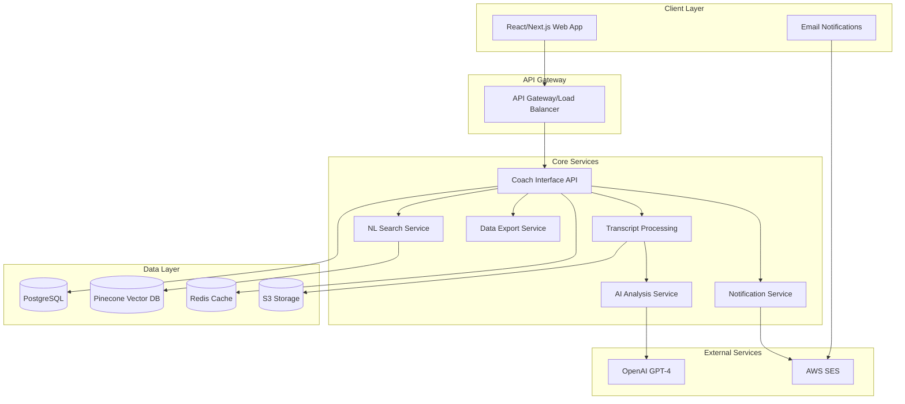

# High Level Architecture

## Technical Summary

The Coaching Supervision & Automation Platform employs a microservices-within-monorepo architecture, optimizing for rapid development while maintaining service boundaries for future scaling. The system leverages Python/FastAPI for backend services, PostgreSQL for structured data, Pinecone for vector embeddings enabling natural language search, and React/Next.js for the coach interface. Core architectural patterns include event-driven processing for transcript analysis, CQRS for separating read/write operations on coaching data, and a chat-based iterative refinement system that builds coach trust through transparent AI collaboration. This architecture directly supports the PRD goals of reducing coach administrative time by 85% while maintaining 95% AI accuracy through human-in-the-loop validation.

## High Level Overview

**Architectural Style:** Microservices within Monorepo - providing service isolation with development simplicity

**Repository Structure:** Monorepo containing all platform services, shared utilities, and infrastructure code

**Service Architecture:** 
- Transcript Processing Service - Handles ingestion and initial parsing
- AI Analysis Service - Manages GPT-4 interactions and prompt engineering  
- Natural Language Search Service - Vector search and semantic querying
- Coach Interface API - REST/WebSocket APIs for the web interface
- Notification Service - Email alerts and coach communications
- Data Export Service - CRM integration and bulk data exports

**Primary Data Flow:**
1. Coach uploads transcript → Processing pipeline extracts participants
2. AI Analysis generates summaries → Coach reviews via chat interface
3. Iterative refinement → Approved content sent to clients
4. All data indexed for natural language search

**Key Architectural Decisions:**
- Asynchronous processing for transcript analysis to handle variable loads
- Separate vector database for semantic search capabilities
- WebSocket connections for real-time chat refinement
- Event-driven architecture for service decoupling

## High Level Project Diagram

## Architectural and Design Patterns

- **Event-Driven Architecture:** Using AWS SNS/SQS for service communication - *Rationale:* Enables asynchronous processing of transcripts and decouples services for independent scaling
- **CQRS Pattern:** Separate read/write models for coaching data - *Rationale:* Optimizes natural language queries while maintaining transactional consistency for session data
- **Repository Pattern:** Abstract data access for all entities - *Rationale:* Enables testing with mocks and potential future database migrations
- **Saga Pattern:** Orchestrate multi-step transcript processing workflow - *Rationale:* Ensures reliable completion of complex AI analysis pipeline with compensation logic
- **Circuit Breaker:** For OpenAI API and external service calls - *Rationale:* Prevents cascade failures when external services are unavailable
- **Hexagonal Architecture:** Core business logic isolated from infrastructure - *Rationale:* Keeps coaching domain logic independent of technical implementation details
- **Chat-Based Command Pattern:** Natural language commands translated to system operations - *Rationale:* Enables intuitive coach interaction while maintaining structured backend processing
