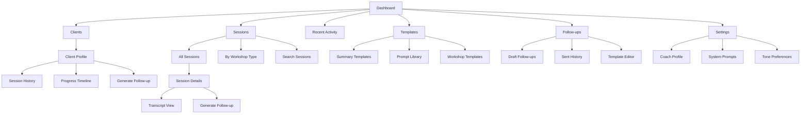
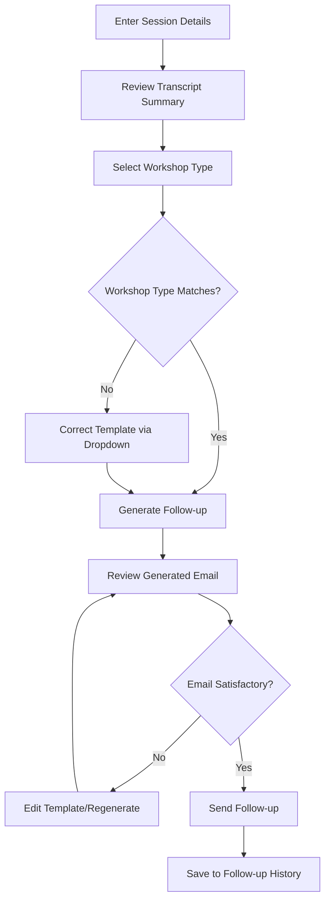

# Mindscribe UI/UX Specification

## Introduction

This document defines the user experience goals, information architecture, user flows, and visual design specifications for **Mindscribe** - an intelligent meeting database platform that transforms how coaches interact with session transcripts and client data. 

Mindscribe eliminates the friction coaches face when reviewing Zoom summaries and enables them to quickly generate tailored client follow-ups through natural language querying across session history. The platform serves as the foundation for coaches to browse group-organized sessions, track client progress, and create meaningful post-session communications.

**Core Problem Solved:** Coaches currently struggle with basic Zoom summaries, scattered across separate accounts, making it difficult to review sessions or leverage transcript data for client follow-ups. Mindscribe transforms this workflow into an intelligent, searchable, and actionable coaching toolkit.

### Overall UX Goals & Principles

#### Target User Personas

**Primary Coach:** Professional coaches who facilitate multiple coaching groups, need quick access to session insights, and must generate personalized follow-ups efficiently. They're comfortable with web tools but value simplicity over complexity.

**Coaching Team Lead:** Senior coaches who oversee multiple coaching groups and need visibility across team activities for quality assurance and client progress tracking.

#### Usability Goals

- **Rapid Session Access:** Coaches can find and review any session within 30 seconds
- **Effortless Follow-up Creation:** Generate tailored client emails in under 2 minutes
- **Intuitive Natural Language Search:** Query client history using conversational language
- **Seamless Group Navigation:** Switch between coaching groups with single-click ease

#### Design Principles

1. **Coach-First Design** - Every feature serves the daily coaching workflow
2. **Intelligent Simplicity** - Powerful search capabilities with clean, uncluttered interface  
3. **Context Preservation** - Always maintain awareness of current group and client context
4. **Speed of Insight** - Minimize clicks between discovery and action
5. **Natural Interaction** - Conversations with data feel as natural as conversations with clients

#### Change Log

| Date | Version | Description | Author |
|------|---------|-------------|---------|
| 2025-08-16 | 1.0 | Initial specification creation | Sally (UX Expert) |

## Information Architecture (IA)

### Site Map / Screen Inventory

### Navigation Structure

**Primary Navigation:** Client-centric top navigation with Dashboard, Clients, Sessions, Templates, Follow-ups, and Settings

**Secondary Navigation:** Context-sensitive sidebar showing client details, session filters, or template categories based on current section

**Breadcrumb Strategy:** Client > Session > Action breadcrumbs to maintain relationship context throughout the workflow

## User Flows

### Post-Session Follow-up Creation

**User Goal:** Generate a personalized follow-up email for a client after reviewing their workshop session

**Entry Points:** Session details page, Client profile, Dashboard recent activity

**Success Criteria:** Coach sends meaningful follow-up email within 2 minutes of reviewing session

#### Flow Diagram

#### Edge Cases & Error Handling:
- Missing session transcript or incomplete data
- Template generation failure or timeout
- Client email address not available
- Network issues during send process
- Coach wants to save draft instead of sending immediately

**Notes:** Flow emphasizes speed and template flexibility. Critical decision point is workshop type validation since mismatched templates could generate inappropriate follow-ups.

## Wireframes & Mockups

**Primary Design Files:** To be created in design tool (Figma recommended for collaboration)

### Key Screen Layouts

#### Dashboard
**Purpose:** Provide coaches with quick access to recent client activity and immediate action items

**Key Elements:**
- Recent client sessions overview
- Quick search bar for natural language queries
- Action buttons for common tasks (new follow-up, review session)

**Interaction Notes:** Emphasize speed of access to recent activity, inspired by Otter AI's clean interface patterns

**Design File Reference:** [Dashboard wireframe to be created]

#### Session Details
**Purpose:** Enable coaches to review transcript summaries and generate follow-ups efficiently

**Key Elements:**
- Transcript summary with highlights
- Workshop type selector/corrector dropdown
- Generate follow-up action button

**Interaction Notes:** Single-page workflow from review to action, similar to Otter AI's transcript interface

**Design File Reference:** [Session details wireframe to be created]

#### Follow-up Generation
**Purpose:** Transform session insights into personalized client emails using templates

**Key Elements:**
- Template selection interface
- Generated email preview
- Edit/regenerate options

**Interaction Notes:** Template-driven workflow with quick customization capabilities

**Design File Reference:** [Follow-up generation wireframe to be created]

#### Client Profile
**Purpose:** Provide comprehensive view of individual client progress across sessions

**Key Elements:**
- Session history timeline
- Progress indicators
- Quick follow-up generation

**Interaction Notes:** Relationship-focused interface showing client journey over time

**Design File Reference:** [Client profile wireframe to be created]

## Component Library / Design System

**Design System Approach:** Use a lightweight, modern design system (such as Tailwind UI, Chakra UI, or similar) as foundation, with custom coaching-specific components built on top for rapid one-week development.

### Core Components

#### SessionCard
**Purpose:** Display session summary with key metadata and actions

**Variants:** Recent (dashboard), detailed (session list), minimal (client history)

**States:** Unread, processing, ready for follow-up, completed

**Usage Guidelines:** Primary discovery mechanism for sessions across the platform

#### FollowUpGenerator
**Purpose:** Template-driven email generation interface

**Variants:** Quick (embedded), detailed (full page), template editor

**States:** Template selection, generating, review, sending, sent

**Usage Guidelines:** Core value delivery component, should feel responsive and intelligent

#### ClientTimeline
**Purpose:** Visual representation of client progress across sessions

**Variants:** Compact (profile sidebar), expanded (full view)

**States:** Loading, populated, empty state

**Usage Guidelines:** Relationship visualization, emphasize growth and insights

## Branding & Style Guide

### Visual Identity
**Brand Guidelines:** Clean, professional design that conveys intelligence and trustworthiness - essential for coaches managing sensitive client relationships

### Color Palette
| Color Type | Hex Code | Usage |
|------------|----------|--------|
| Primary | #3B82F6 | Primary actions, links, key highlights |
| Secondary | #6366F1 | Secondary actions, accents |
| Accent | #10B981 | Success states, positive feedback |
| Success | #10B981 | Positive feedback, confirmations |
| Warning | #F59E0B | Cautions, important notices |
| Error | #EF4444 | Errors, destructive actions |
| Neutral | #6B7280, #F3F4F6 | Text, borders, backgrounds |

### Typography

#### Font Families
- **Primary:** Inter (clean, readable, professional)
- **Secondary:** System fonts fallback for performance
- **Monospace:** SF Mono / Consolas (for transcript text)

#### Type Scale
| Element | Size | Weight | Line Height |
|---------|------|--------|-------------|
| H1 | 2rem | 600 | 1.2 |
| H2 | 1.5rem | 600 | 1.3 |
| H3 | 1.25rem | 500 | 1.4 |
| Body | 1rem | 400 | 1.6 |
| Small | 0.875rem | 400 | 1.5 |

### Iconography
**Icon Library:** Heroicons or Lucide (consistent with professional aesthetic)

**Usage Guidelines:** Minimal, outline-style icons that complement the clean interface

### Spacing & Layout
**Grid System:** 8px base grid system for consistent spacing

**Spacing Scale:** 0.5rem, 1rem, 1.5rem, 2rem, 3rem, 4rem

## Accessibility Requirements

### Compliance Target
**Standard:** WCAG 2.1 AA standard to ensure broad accessibility for coaching professionals

### Key Requirements

**Visual:**
- Color contrast ratios: 4.5:1 for normal text, 3:1 for large text
- Focus indicators: Visible focus rings on all interactive elements
- Text sizing: Support up to 200% zoom without horizontal scrolling

**Interaction:**
- Keyboard navigation: Full functionality accessible via keyboard
- Screen reader support: Semantic HTML with proper ARIA labels
- Touch targets: Minimum 44px for mobile interaction

**Content:**
- Alternative text: Descriptive alt text for all meaningful images
- Heading structure: Logical H1-H6 hierarchy for navigation
- Form labels: Clear, descriptive labels for all form inputs

### Testing Strategy
Manual keyboard navigation testing, screen reader testing with NVDA/JAWS, automated accessibility scanning with axe-core

## Responsiveness Strategy

### Breakpoints
| Breakpoint | Min Width | Max Width | Target Devices |
|------------|-----------|-----------|----------------|
| Mobile | 320px | 767px | Smartphones, quick mobile access |
| Tablet | 768px | 1023px | iPads, mobile coaching scenarios |
| Desktop | 1024px | 1439px | Laptops, primary coaching workstations |
| Wide | 1440px | - | Large monitors, multi-session management |

### Adaptation Patterns

**Layout Changes:** Desktop uses sidebar navigation, mobile collapses to bottom tab bar. Session details stack vertically on mobile, use two-column layout on desktop.

**Navigation Changes:** Desktop persistent sidebar, tablet/mobile hamburger menu with overlay. Client switching uses dropdown on mobile, dedicated panel on desktop.

**Content Priority:** Mobile prioritizes recent sessions and quick actions, desktop shows comprehensive dashboards. Follow-up generation uses full-screen modal on mobile, inline panel on desktop.

**Interaction Changes:** Mobile emphasizes touch targets and swipe gestures, desktop supports keyboard shortcuts and hover states.

## Animation & Micro-interactions

### Motion Principles
Subtle, purposeful animations that provide feedback and guide attention. Performance and accessibility considerations prioritized over decorative effects.

### Key Animations
- **Loading States:** Skeleton loading for session cards and transcript content (Duration: 200ms, Easing: ease-out)
- **Follow-up Generation:** Progress indicator with subtle pulse during AI generation (Duration: 1s loop, Easing: ease-in-out)
- **Navigation Transitions:** Smooth page transitions with fade effects (Duration: 150ms, Easing: ease-in-out)
- **Success Feedback:** Gentle bounce on successful follow-up send (Duration: 300ms, Easing: ease-back)
- **Focus Indicators:** Smooth focus ring appearance for accessibility (Duration: 100ms, Easing: ease-out)
